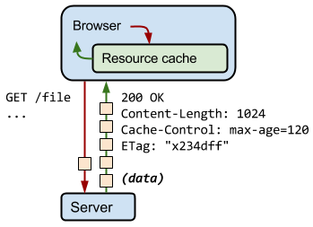
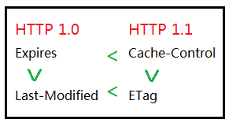
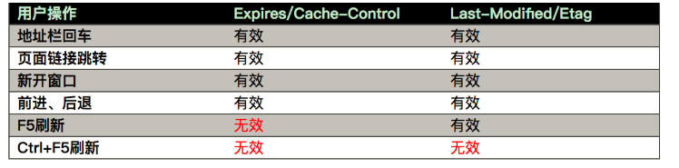

# 一、概述

缓存是**请求资源的副本**。是性能优化中简单高效的一种优化方式。


## **优点**/作用

- 缓解服务器压力（不用每次去请求资源）。
- 提升性能，降低客户端获取资源的延迟：缓存通常位于内存中，读取缓存的速度更快。并且缓存服务器在地理位置上也有可能比源服务器来得近，例如浏览器缓存。
- 减少带宽消耗。缓存文件可以重复利用，可以减少带宽，降低网络负荷。
- 保证稳定性


对于一个数据请求来说，可以分为发起网络请求、后端处理、浏览器响应三个步骤。浏览器缓存可以在第一和第三步骤中优化性能。比如说直接使用缓存而不发起请求，或者发起了请求但后端存储的数据和前端一致，减少了响应数据。


## 缓存特征

**命中率**

当某个请求能够通过访问缓存而得到响应时，称为缓存命中。缓存命中率越高，缓存的利用率也就越高。

**最大空间**

缓存通常位于内存中，内存的空间通常比磁盘空间小的多，因此缓存的最大空间不可能非常大。

当缓存存放的数据量超过最大空间时，就需要淘汰部分数据来存放新到达的数据。

**淘汰策略**

- FIFO（First In First Out）：先进先出策略，在实时性的场景下，需要经常访问最新的数据，那么就可以使用 FIFO，使得最先进入的数据（最晚的数据）被淘汰。

- LRU（Least Recently Used）：最近最久未使用策略，优先淘汰最久未使用的数据，也就是上次被访问时间距离现在最久的数据。该策略可以保证内存中的数据都是热点数据，也就是经常被访问的数据，从而保证缓存命中率。

- LFU（Least Frequently Used）：最不经常使用策略，优先淘汰一段时间内使用次数最少的数据。

## 缓存位置

缓存在宏观上可以分成两类：**私有缓存**和**共享缓存**。共享缓存是能被各级代理缓存的缓存。私有缓存是用户专享的，各级代理不能缓存的缓存。

从缓存位置上来说分为四种，并且各自有优先级，当依次查找缓存且都没有命中的时候，才会去请求网络。

- Service Worker
- Memory Cache
- Disk Cache
- Push Cache

> **Service Worker > Memory Cache > Disk Cache > Push Cache > 网络请求**

继续细分：

**浏览器缓存**

当 HTTP 响应允许进行缓存时，浏览器会将 HTML、CSS、JavaScript、图片等静态资源进行缓存。

- 本地存储：WebStorage（localStorage、SessionStorage）、Cookie、WebSQL、indexDB、应用缓存、PWA。
- 默认缓存：往返缓存 BFCache


**ISP 缓存**

网络服务提供商（ISP）是网络访问的第一跳，通过将数据缓存在 ISP 中能够大大提高用户的访问速度。


**代理服务器缓存**

缓存原理和浏览器端类似，但规模要大得多。大公司和大型的 ISP 提供商通常会将它们设立在防火墙上或是作为一个独立的设备来运营。

代理服务器缓存是一个共享缓存，不只为一个用户服务，经常为大量用户使用，因此在减少相应时间和带宽使用方面很有效：因为同一个缓存可能会被重用多次。


**反向代理缓存**

也称为网关缓存、代理缓存。反向代理位于服务器之前，请求与响应都需要经过反向代理。通过将数据缓存在反向代理，在用户请求反向代理时就可以直接使用缓存进行响应。

CDNS（网络内容分发商）分布网关缓存到整个（或部分）互联网上，并出售缓存服务给需要的网站，比如国内的七牛云、又拍云都有这种服务。


**本地缓存**

使用 Guava Cache 将数据缓存在服务器本地内存中，服务器代码可以直接读取本地内存中的缓存，速度非常快。


**分布式缓存**

使用 Redis、Memcache 等分布式缓存将数据缓存在分布式缓存系统中。

相对于本地缓存来说，分布式缓存单独部署，可以根据需求分配硬件资源。不仅如此，服务器集群都可以访问分布式缓存，而本地缓存需要在服务器集群之间进行同步，实现难度和性能开销上都非常大。


**数据库缓存**

MySQL 等数据库管理系统具有自己的查询缓存机制来提高查询效率。


**Java 内部的缓存**

Java 为了优化空间，提高字符串、基本数据类型包装类的创建效率，设计了字符串常量池及 Byte、Short、Character、Integer、Long、Boolean 这六种包装类缓冲池。


**CPU 多级缓存**

CPU 为了解决运算速度与主存 IO 速度不匹配的问题，引入了多级缓存结构，同时使用 MESI 等缓存一致性协议来解决多核 CPU 缓存数据一致性的问题。


# 二、HTTP 缓存


<div align="center">  </div><br>


**实现方法**

- 让代理服务器进行缓存；
- 让客户端浏览器进行缓存。


## 缓存头

HTTP 报文头部中与缓存相关的字段为：

- 通用首部字段
  - **Cache-control**：控制缓存的行为
  - **Pragma**：HTTP 1.0 的遗留物。报文指令。值为“no-cache”时禁用缓存。
- 请求首部字段
  - If-Match：比较 ETag 是否一致。
  - If-Modified-Since：比较资源最后更新的时间是否一致。
  - If-None-Match：比较 ETag 是否不一致。（与 If-Match 相反）
  - If-Unmodified-Since：比较资源最后更新的时间是否不一致。（与 If-Modified-Since 相反）
- 响应首部字段
  - **ETag**：资源的匹配信息
  - Vary：代理服务器缓存的管理信息
  - Age：资源在缓存代理中存贮的时长(取决于 max-age 和 s-maxage 的大小)。
- 实体首部字段
  - **Expires**：HTTP 1.0 的遗留物。实体主体过期的日期时间
  - **Last-Modified**：资源的最后修改日期时间

缓存常用字段比较：

| 头部          | 优势和特点                                                   | 劣势和问题                                                   |
| ------------- | ------------------------------------------------------------ | ------------------------------------------------------------ |
| Expires       | 1、HTTP 1.0 产物，可以在HTTP 1.0 和 1.1 中使用，简单易用。2、以时刻标识失效时间。 | 1、时间是由服务器发送的(UTC)，如果服务器时间和客户端时间存在不一致，可能会出现问题。2、存在版本问题，到期之前的修改客户端是不可知的。 |
| Cache-Control | 1、HTTP 1.1 产物，以时间间隔标识失效时间，解决了Expires 服务器和客户端相对时间的问题。2、比Expires 多了很多选项设置。 | 1、HTTP 1.1 才有的内容，不适用于 HTTP 1.0 。2、存在版本问题，到期之前的修改客户端是不可知的。 |
| Last-Modified | 1、不存在版本问题，每次请求都会去服务器进行校验。服务器对比最后修改时间如果相同则返回 304，不同返回 200 以及资源内容。 | 1、只要资源修改，无论内容是否发生实质性的变化，都会将该资源返回客户端。例如周期性重写，这种情况下该资源包含的数据实际上一样的。2、以时刻作为标识，无法识别一秒内进行多次修改的情况。3、某些服务器不能精确的得到文件的最后修改时间。 |
| ETag          | （HTTP 1.1）1、可以更加精确的判断资源是否被修改，可以识别一秒内多次修改的情况。2、不存在版本问题，每次请求都回去服务器进行校验。 | 1、计算 ETag 值需要性能损耗。2、分布式服务器存储的情况下，计算 ETag 的算法如果不一样，会导致浏览器从一台服务器上获得页面内容后到另外一台服务器上进行验证时发现 ETag 不匹配的情况。 |


HTTP 1.1 > HTTP 1.0，所以 Cache-Control > Expires，ETag > Last-Modified。

<div align="center">  </div><br>

强缓存： **pragma > cache-control > expires**

协商缓存： **Etag > Last-Modified**


## 缓存策略


**HTTP 缓存的流程**

<div align="center">  </div><br>


HTTP缓存有多种规则，根据是否需要重新向服务器发起请求来分类，可以将其分为两大类：

- 强制缓存：如果生效，不需要再和服务器发生交互
- 协商缓存（对比缓存）：不管是否生效，都需要与服务端发生交互。

两类缓存规则可以同时存在，强制缓存优先级高于对比缓存，也就是说，当执行强制缓存的规则时，如果缓存生效，直接使用缓存，不再执行对比缓存规则。


（浏览器请求资源前会先看有没有缓存，有且没有过期就返回200，直接使用缓存，这就是强缓存，用到expire或者max-age；如果有缓存但是过期了，就发起请求，带上`Etag`或者`Last-Modified`，然后服务器响应头带上`If-Not-Matched`或者`If-Modified-Since`，如果没有更新就返回304状态码，否则返回200并发送新的资源）


### 强缓存

如果浏览器中存在缓存数据并且数据没有过期，那么直接从缓存中读取数据，无需向服务器发起询问。

在 Chrome DevTools 的 Network 选项中可以看到该请求返回 200 的状态码，并且 Size 显示 from disk cache 或 from memory cache。

相关头部字段：

- Cache-Control

  HTTP/1.1 通过 Cache-Control 首部字段来控制缓存。

  - `max-age=<seconds>` 设置缓存存储的最大周期，超过这个时间缓存被认为过期(单位秒)。与 Expires 相反，时间是相对于请求的时间。
  - public ：**公共缓存**。规定了将资源作为公共缓存，可以被多个用户使用，一般存储在代理服务器中。表明响应可以被任何对象（包括：发送请求的客户端，代理服务器，等等）缓存，即使是通常不可缓存的内容。
  - private ：**私有缓存**。规定了将资源作为私有缓存，只能被单独用户使用，一般存储在用户浏览器中。表明响应只能被单个用户缓存，不能作为共享缓存（即代理服务器不能缓存它）。私有缓存可以缓存响应内容
  - no-cache ：**强制确认缓存** 。规定缓存服务器需要先向源服务器验证缓存资源的有效性，只有当缓存资源有效时才能使用该缓存对客户端的请求进行响应。告诉浏览器、缓存服务器，不管本地副本是否过期，使用资源副本前，一定要到源服务器进行副本有效性校验
  - no-store ：**禁止进行缓存**。规定不能对请求或响应的任何一部分进行缓存。缓存不应存储有关客户端请求或服务器响应的任何内容

- Expires：缓存过期时间，用来指定资源到期的时间，是服务器端的具体的时间点。HTTP/1.0 的产物，受限于本地时间，如果修改了本地时间，可能会造成缓存失效。


**缓存过期机制**  

`max-age` 和 `Expires` 可以设置过期时间。

max-age 指令出现在请求报文，并且缓存资源的缓存时间小于该指令指定的时间，那么就能接受该缓存。

max-age 指令出现在响应报文，表示缓存资源在缓存服务器中保存的时间。

```html
Cache-Control: max-age=31536000
```

Expires 首部字段也可以用于告知缓存服务器该资源什么时候会过期。

```html
Expires: Wed, 04 Jul 2012 08:26:05 GMT
```

- 在 HTTP/1.1 中，会优先处理 max-age 指令；
- 在 HTTP/1.0 中，max-age 指令会被忽略掉。


强缓存判断是否缓存的依据来自于是否超出某个时间或者某个时间段，而不关心服务器端文件是否已经更新，这可能会导致加载文件不是服务器端最新的内容，**那如何获知服务器端内容是否已经发生了更新呢**？此时需要用到协商缓存策略。


### 协商缓存

协商缓存就是强制缓存失效后，浏览器携带缓存标识向服务器发起请求，由服务器根据缓存标识决定是否使用缓存的过程，主要有以下两种情况：

- 协商缓存生效，返回 304 和 Not Modified
- 协商缓存失效，返回 200 和请求结果

**缓存验证**

相关头部字段：

- **Last-Modified 响应头和 If-Modified-Since 请求头**

Last-Modified 首部字段也可以用于缓存验证，它包含在源服务器发送的响应报文中，指示源服务器对**资源的最后修改时间**。在浏览器第一次发起 HTTP 请求时，服务器会返回该响应头。

但是它是一种弱校验器，因为只能精确到一秒，所以它通常作为 ETag 的备用方案。如果响应首部字段里含有这个信息，客户端可以在后续的请求中带上 If-Modified-Since 来验证缓存。

服务器只在所请求的<u>资源在给定的日期时间之后</u>**对内容进行过修改**的情况下才会将资源返回，状态码为 200 OK。如果请求的资源从那时起未经修改，那么返回一个不带有实体主体的 304 Not Modified 响应报文。

```html
Last-Modified: Wed, 21 Oct 2015 07:28:00 GMT
```

```html
If-Modified-Since: Wed, 21 Oct 2015 07:28:00 GMT
```

- **Etag 响应头和 If-None-Match 请求头**

什么是 Etag？说说 ETag 的应用。

Etag 首部字段的值为当前资源在服务器的唯一标识（生成规则由服务器决定），在浏览器第一次发起 HTTP 请求时，服务器会返回该响应头。URL 不能唯一表示资源，例如 `http://www.google.com/` 有中文和英文两个资源，只有 ETag 才能对这两个资源进行唯一标识。

```html
ETag: "82e22293907ce725faf67773957acd12"
```

可以将缓存资源的 ETag 值放入 If-None-Match 首部，服务器收到该请求后，判断缓存资源的 ETag 值和资源的最新 ETag 值是否一致，如果一致则表示**缓存资源有效**，返回 304 Not Modified。如果不同则表示资源有被改动过，响应完整的资源内容，返回 200。

```html
If-None-Match: "82e22293907ce725faf67773957acd12"
```


## 实际场景应用

不同场景下缓存的设置

**频繁变动的资源**

Cache-Control: no-cache + ETag / Last-Modified

对于频繁变动的资源，首先需要使用 `Cache-Control: no-cache` 使浏览器每次都请求服务器，然后配合 ETag 或者 Last-Modified 来验证资源是否有效。这样的做法虽然不能节省请求数量，但是能显著减少响应数据大小。

**不常变动的资源**

Cache-Control: max-age=31536000

通常在处理这类资源时，给它们的 Cache-Control 配置一个很大的 `max-age=31536000` (一年)，这样浏览器之后请求相同的 URL 会命中强制缓存。而为了解决更新的问题，就需要在文件名(或者路径)中添加 hash， 版本号等动态字符，之后更改动态字符，从而达到更改引用 URL 的目的，让之前的强制缓存失效 (其实并未立即失效，只是不再使用了而已)。
 在线提供的类库 (如 `jquery-3.3.1.min.js`, `lodash.min.js` 等) 均采用这个模式。


## 用户行为影响

所谓用户行为对浏览器缓存的影响，指的就是用户在浏览器如何操作时，会触发怎样的缓存策略。主要有 3 种：

- 打开网页，地址栏输入地址： 查找 disk cache 中是否有匹配。如有则使用；如没有则发送网络请求。
- 普通刷新 (F5)：因为 TAB 并没有关闭，因此 memory cache 是可用的，会被优先使用(如果匹配的话)。其次才是 disk cache。
- 强制刷新 (Ctrl + F5)：浏览器不使用缓存，因此发送的请求头部均带有 `Cache-control: no-cache`(为了兼容，还带了 `Pragma: no-cache`),服务器直接返回 200 和最新内容。

<div align="center">  </div><br>


# 三、CDN

内容分发网络（Content distribute network 或 Content Delivery Network，CDN）是一种互连的网络系统，它利用更靠近用户的服务器从而更快更可靠地将 HTML、CSS、JavaScript、音乐、图片、视频等静态资源分发给用户。

其基本思路是尽可能避开互联网上有可能影响数据传输速度和稳定性的瓶颈和环节，使内容传输的更快、更稳定。

CDN 是服务器端缓存。

<div align="center">  </div><br>

典型的CDN系统由下面三个部分组成：

- 分发服务系统/分布式存储

- 负载均衡系统

  主要功能是负责对所有发起服务请求的用户进行访问调度，确定提供给用户的最终实际访问地址。两级调度体系分为全局负载均衡（GSLB）和本 地负载均衡（SLB）。GSLB主要根据用户就近性原则，通过对每个服务节点进行“最优”判断，确定向用户提供服务的cache的物理位置。SLB主要负 责节点内部的设备负载均衡

- 运营管理系统

  分为运营管理和网络管理子系统，负责处理业务层面的与外界系统交互所必须的收集、整理、交付工作，包含客户管理、产品管理、计费管理、统计分析等功能。


CDN 主要有以下优点：

- 更快地将数据分发给用户；
- 通过部署多台服务器，从而提高系统整体的带宽性能；
- 多台服务器可以看成是一种冗余机制，从而具有高可用性。
- 镜像服务，消除运营商之间互联的瓶颈影响，保证不同网络的用户都能得到良好的访问质量
- 远程加速，自动选择cache服务器
- 集群抗攻击
- 节约成本


**CDN的问题**

CDN的分流作用不仅减少了用户的访问延时，也减少了源站的负载。
但其缺点主要是缓存的同步问题：当网站更新时，如果CDN节点上数据没有及时更新，即便用户再浏览器使用Ctrl +F5的方式使浏览器端的缓存失效，也会因为CDN边缘节点没有同步最新数据而导致用户访问异常。

**如何解决CDN的问题**

CDN的主要问题是由于缓存同步不及时带来的，缓存更新有两种方式：

- 定制缓存策略

  静态文件在返回时由源服务器控制expires、cache-control等属性来定义CDN的缓存策略。

- 源服务器资源更新时，主动刷新CDN缓存

  CDN边缘节点对开发者是透明的，相比于浏览器Ctrl+F5的强制刷新来使浏览器本地缓存失效，开发者可以通过CDN服务商提供的“刷新缓存”接口来达到清理CDN边缘节点缓存的目的。这样开发者在更新数据后，可以使用“刷新缓存”功能来强制CDN节点上的数据缓存过期，保证客户端在访问时，拉取到最新的数据。


# 四、缓存问题

## 缓存穿透

指的是对某个一定不存在的数据进行请求，该请求将会穿透缓存到达数据库。

解决方案：

- 对这些不存在的数据缓存一个空数据；
- 对这类请求进行过滤。

## 缓存雪崩

指的是由于数据没有被加载到缓存中，或者缓存数据在同一时间大面积失效（过期），又或者缓存服务器宕机，导致大量的请求都到达数据库。

在有缓存的系统中，系统非常依赖于缓存，缓存分担了很大一部分的数据请求。当发生缓存雪崩时，数据库无法处理这么大的请求，导致数据库崩溃。

解决方案：

- 为了防止缓存在同一时间大面积过期导致的缓存雪崩，可以通过观察用户行为，合理设置缓存过期时间来实现；
- 为了防止缓存服务器宕机出现的缓存雪崩，可以使用分布式缓存，分布式缓存中每一个节点只缓存部分的数据，当某个节点宕机时可以保证其它节点的缓存仍然可用。
- 也可以进行缓存预热，避免在系统刚启动不久由于还未将大量数据进行缓存而导致缓存雪崩。


## 缓存一致性

缓存一致性要求数据更新的同时缓存数据也能够实时更新。

解决方案：

- 在数据更新的同时立即去更新缓存；
- 在读缓存之前先判断缓存是否是最新的，如果不是最新的先进行更新。

要保证缓存一致性需要付出很大的代价，缓存数据最好是那些对一致性要求不高的数据，允许缓存数据存在一些脏数据。

## 缓存 “无底洞” 现象

指的是为了满足业务要求添加了大量缓存节点，但是性能不但没有好转反而下降了的现象。

产生原因：缓存系统通常采用 hash 函数将 key 映射到对应的缓存节点，随着缓存节点数目的增加，键值分布到更多的节点上，导致客户端一次批量操作会涉及多次网络操作，这意味着批量操作的耗时会随着节点数目的增加而不断增大。此外，网络连接数变多，对节点的性能也有一定影响。

解决方案：

- 优化批量数据操作命令；
- 减少网络通信次数；
- 降低接入成本，使用长连接 / 连接池，NIO 等。

# 五、数据分布

## 哈希分布

哈希分布就是将数据计算哈希值之后，按照哈希值分配到不同的节点上。例如有 N 个节点，数据的主键为 key，则将该数据分配的节点序号为：hash(key)%N。

传统的哈希分布算法存在一个问题：当节点数量变化时，也就是 N 值变化，那么几乎所有的数据都需要重新分布，将导致大量的数据迁移。

## 顺序分布

将数据划分为多个连续的部分，按数据的 ID 或者时间分布到不同节点上。例如 User 表的 ID 范围为 1 \~ 7000，使用顺序分布可以将其划分成多个子表，对应的主键范围为 1 \~ 1000，1001 \~ 2000，...，6001 \~ 7000。

顺序分布相比于哈希分布的主要优点如下：

- 能保持数据原有的顺序；
- 并且能够准确控制每台服务器存储的数据量，从而使得存储空间的利用率最大。

# 六、一致性哈希

Distributed Hash Table（DHT） 是一种哈希分布方式，其目的是为了克服传统哈希分布在服务器节点数量变化时大量数据迁移的问题。

## 基本原理

将哈希空间 [0, 2<sup>n</sup>-1] 看成一个哈希环，每个服务器节点都配置到哈希环上。每个数据对象通过哈希取模得到哈希值之后，存放到哈希环中顺时针方向第一个大于等于该哈希值的节点上。

<div align="center">  </div><br>

一致性哈希在增加或者删除节点时只会影响到哈希环中相邻的节点，例如下图中新增节点 X，只需要将它前一个节点 C 上的数据重新进行分布即可，对于节点 A、B、D 都没有影响。

<div align="center">  </div><br>

## 虚拟节点

上面描述的一致性哈希存在数据分布不均匀的问题，节点存储的数据量有可能会存在很大的不同。

数据不均匀主要是因为节点在哈希环上分布的不均匀，这种情况在节点数量很少的情况下尤其明显。

解决方式是通过增加虚拟节点，然后将虚拟节点映射到真实节点上。虚拟节点的数量比真实节点来得多，那么虚拟节点在哈希环上分布的均匀性就会比原来的真实节点好，从而使得数据分布也更加均匀。

# 七、LRU

以下是基于 双向链表 + HashMap 的 LRU 算法实现，对算法的解释如下：

- 访问某个节点时，将其从原来的位置删除，并重新插入到链表头部。这样就能保证链表尾部存储的就是最近最久未使用的节点，当节点数量大于缓存最大空间时就淘汰链表尾部的节点。
- 为了使删除操作时间复杂度为 O(1)，就不能采用遍历的方式找到某个节点。HashMap 存储着 Key 到节点的映射，通过 Key 就能以 O(1) 的时间得到节点，然后再以 O(1) 的时间将其从双向队列中删除。

```java
public class LRU<K, V> implements Iterable<K> {

    private Node head;
    private Node tail;
    private HashMap<K, Node> map;
    private int maxSize;

    private class Node {

        Node pre;
        Node next;
        K k;
        V v;

        public Node(K k, V v) {
            this.k = k;
            this.v = v;
        }
    }


    public LRU(int maxSize) {

        this.maxSize = maxSize;
        this.map = new HashMap<>(maxSize * 4 / 3);

        head = new Node(null, null);
        tail = new Node(null, null);

        head.next = tail;
        tail.pre = head;
    }


    public V get(K key) {

        if (!map.containsKey(key)) {
            return null;
        }

        Node node = map.get(key);
        unlink(node);
        appendHead(node);

        return node.v;
    }


    public void put(K key, V value) {

        if (map.containsKey(key)) {
            Node node = map.get(key);
            unlink(node);
        }

        Node node = new Node(key, value);
        map.put(key, node);
        appendHead(node);

        if (map.size() > maxSize) {
            Node toRemove = removeTail();
            map.remove(toRemove.k);
        }
    }


    private void unlink(Node node) {

        Node pre = node.pre;
        Node next = node.next;

        pre.next = next;
        next.pre = pre;

        node.pre = null;
        node.next = null;
    }


    private void appendHead(Node node) {
        Node next = head.next;
        node.next = next;
        next.pre = node;
        node.pre = head;
        head.next = node;
    }


    private Node removeTail() {

        Node node = tail.pre;

        Node pre = node.pre;
        tail.pre = pre;
        pre.next = tail;

        node.pre = null;
        node.next = null;

        return node;
    }


    @Override
    public Iterator<K> iterator() {

        return new Iterator<K>() {
            private Node cur = head.next;

            @Override
            public boolean hasNext() {
                return cur != tail;
            }

            @Override
            public K next() {
                Node node = cur;
                cur = cur.next;
                return node.k;
            }
        };
    }
}
```


# 参考资料

- 大规模分布式存储系统
- [缓存那些事](https://tech.meituan.com/cache_about.html)
- [一致性哈希算法](https://my.oschina.net/jayhu/blog/732849)
- [内容分发网络](https://zh.wikipedia.org/wiki/%E5%85%A7%E5%AE%B9%E5%82%B3%E9%81%9E%E7%B6%B2%E8%B7%AF)
- [How Aspiration CDN helps to improve your website loading speed?](https://www.aspirationhosting.com/aspiration-cdn/)
- HTTP 缓存的四种风味与缓存策略：https://segmentfault.com/a/1190000006689795
- [浅谈浏览器http的缓存机制](https://www.cnblogs.com/vajoy/p/5341664.html)
- [HTTP缓存控制小结](https://www.tuicool.com/articles/URJjAb)
- [深入理解浏览器的缓存机制](https://www.jianshu.com/p/54cc04190252)
- 缓存详解：https://juejin.im/post/5a6c87c46fb9a01ca560b4d7#heading-34
- 一张图理解Http缓存：https://segmentfault.com/a/1190000015816331
- [http请求缓存头详解](https://segmentfault.com/a/1190000013854262)
- [黑金团队 - 前端缓存最佳实践](https://juejin.im/post/5c136bd16fb9a049d37efc47) 
- [黑金团队 - 趣讲CDN](https://juejin.im/post/5c188d06f265da615114acb0)
- [CDN缓存](https://segmentfault.com/a/1190000021446601)