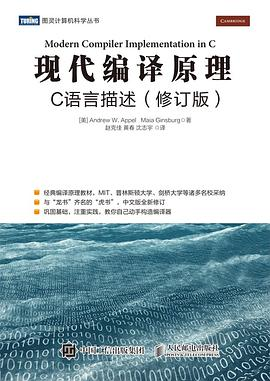
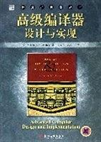

# 编译原理

## 《Compilers: Principles, Techniques and Tools》

Compilers: Principles, Techniques and Tools

编译：原理，技术和工具

Alfred V. Aho, Ravi Sethi and Jeffrey D. Ullman / 2008年12月 / 机械工业出版社 / 

[豆瓣](https://book.douban.com/subject/3296317/)，9.1 分，913 人评分。

  
 

龙书

## 《Modern Compiler Implementation in C》

Modern Compiler Implementation in C

现代编译原理-C语言描述（修订版）

Andrew W.Appel,with Jens Palsberg / 2018-4 / 人民邮电出版社 / 图灵教育（出品）

[豆瓣](https://book.douban.com/subject/30191414/)，9.1 分，27 人评分。

  
 

虎书。出版较晚，与《编译原理》的知识点差不多，但增加了数据流分析、循环优化、内存管理等内容。与虎书比，《编译原理》更适合国内的编译原理课程教学。全面讲述了现代编译器的结构、编译算法和实现方法。本书使用的是更适合广大读者的c语言，而另外两本书分别采用ML语言和Java语言。本书的另一个特点是增加了一些其他编译原理教科书没有涉及的内容。前端增加了面向对象的程序设计语言、函数式程序设计语言等现代语言的编译实现方法，后端增加了针对现代计算机体系结构特征的一些比较成熟的优化方法。这部分内容展现了现代商业编译器需解决的一些关键问题，开拓了学生的视野，为学生未来进行更深入的研究奠定了基础。

## 《Advanced Compiler Design and Implementation》

Advanced Compiler Design and Implementation

高级编译器设计与实现

Steven S.Muchnick / 2005-01-01 / 机械工业出版社 / 

[豆瓣](https://book.douban.com/subject/1400374/)，9.1 分，41 人评分。

  
 

鲸书。经典的编译器著作，与“龙书”齐名。书中针对现代语言和体系结构全面介绍了编译器设计与实现的高级论题，从编译器的基础领域中的高级问题开始，然后深入讨论了各种重要的代码优化。本书专为编译器专业人士和计算机专业本科生，研究生编写，在设计和实现高度优化的编译器以及确定优化的重要性和实现优化的最有效的方法等方面，为读者提供了非常有价值的指导。

