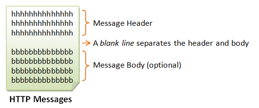
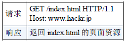
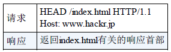

# 一 、基础概念

## **The Web**

Internet（或 Web）是一个庞大的分布式客户端/服务器信息系统，如下图所示。

<div align="center">  </div><br>

许多应用程序正在 Web 上同时运行。为了在客户端和服务器之间进行正确的通信，这些应用程序必须在特定的应用程序级别协议上（例如 HTTP，FTP，SMTP，POP 等）达成一致。

万维网必须解决的几个问题：

- 每一个文档在整个因特网的范围内具有唯一的标识符 URL。
- 为了实现万维网上各种超链之间的链接，使用了 **HTTP 协议**。
- 为了使各种万维网文档都能在因特网上的各种计算机上显示出来，使用了浏览器和 **HTML 语言**。


## URI、URL、URN

> [HTTP-URI,URN和URL - 知乎](https://zhuanlan.zhihu.com/p/39260468)

URI 就像因特网上的邮政地址一样，在世界范围内唯一标识并定位信息资源。URI 有两种形式，分别称为 URL 和 URN。

- URI（Uniform Resource Identifier，统一资源标识符） 
- URL（Uniform Resource Locator，统一资源定位符）
- URN（Uniform Resource Name，统一资源名称）

<div align="center">  </div><br>

URI 是由某个协议方案表示的资源的定位标识符。协议方案是指访问资源所使用的协议类型名称。几种 URI 例子：

<div align="center">  </div><br>

绝对 URI 的格式：

<div align="center">  </div><br>


### **URL**

URI 用字符串标识某一互联网资源，而 URL 表示资源的地点。

URL 是资源标识符最常见的形式，使用 Web 浏览器等访问 Web 页面时需要输入的网页地址，描述了一台特定服务器上某资源的特定位置。

几乎所有的 URI 都是 URL，除非特殊说明，不加区别地使用 URI 和 URL。

**相对 URL 和绝对 URL 是什么？**

- 绝对 URL：一个完整的通信地址
- 相对 URL：以包含 URL 本身的文件位置为参照点，描述目标文件的位置。
  - 同一目录：文件名和扩展名，a.html。
  - 子目录：文件夹名、文件名和扩展名，b/c.html。
  - 上层目录：向上一层：../a.html。向上两层：../../a.html。

**有时候在浏览器输入一部分 URL 时，为什么会自动补全？**

首先，通信过程中需要准确、齐全的 URL，其次是优化体验。

浏览器针对 URL 的处理会提供自动补全功能，主要补全以下两个方面：

- 主机名扩展：补全协议，www 或 com 等
- 历史扩展：记录历史访问过的 URL

**有时候 URL 会带上一些奇怪的符号，为什么能正常访问资源？**

浏览器地址栏的网址：

```
https://github.com/CyC2018/CS-Notes/blob/master/notes/计算机网络 - 目录.md
```

复制粘贴后：

```
https://github.com/CyC2018/CS-Notes/blob/master/notes/%E8%AE%A1%E7%AE%97%E6%9C%BA%E7%BD%91%E7%BB%9C%20-%20%E7%9B%AE%E5%BD%95.md
```

原因是 URL 对非安全字符进行转义了，转义以 % 开始，对其进行解码即可理解内容。

具体原因如下：

- 计算机系倾向于英语为中心，使用 US-ASCII 字符集
- 要传递其他字符集编码的文字时，比如中文、非罗马语言等，US-ASCII 无法直接表达内容。而且特殊内容容易与网关和协议产生混淆，影响通信。

**URL 有什么缺点吗？**

URL 表示资源的地址，当资源被移走时，URL 就失效了，比如：404 错误。404 对用户体验和爬虫都不友好。


### **URN**

**URN 具体是干嘛的？**

URN 是为了解决 URL 缺点而提出来的。

> 《HTTP权威指南》：计算机中的很多问题都是可以通过加一个中间层来解决的。新技术的提出是为了解决旧技术存在的问题。URN 的提出就是为了解决 URL 的缺点，所以 URN 也不是平白无故出现的。

URN 是作为特定内容的唯一名称使用的，与目前的资源所在地无关。使用这些与位置无关的 URN，就可以将资源四处搬移。通过 URN，还可以用同一个名字通过多种网络访问协议来访问资源。


**举例说明 URL 和 URN？**

有人通过你家的地址（URL）找你，结果去到你家发现你人不在（404 错误）。但是可以通过你的身份证号（URN）找你，因为你不管去哪个城市，你的身份证都会留下你的痕迹。但是，这种查找麻烦、成本大。URN 的设想是不错的，但是基础设施还没搭建好，所以没有普及开来。


## HTTP 协议

**HTTP 协议是什么？**

HTTP（HyperText Transfer Protocol，超文本传输协议），是 TCP/IP 协议的一个**应用层协议**，用于客户端和服务器之间的通信。

例子：在浏览器上点击一个链接（URL），浏览器为用户打开这个链接的网页。

原理：在浏览器中点击这个链接时，浏览器会向服务器发送一段文本，告诉服务器请求打开的是哪一个网页。服务器收到请求后，就返回一段文本给浏览器，浏览器会将该文本解析，然后显示出来。这段文本就是遵循 HTTP 协议规范的。


**超文本的含义是什么？**

超文本（HyperText，HT，全称“超级文本”），由 Ted Nelson 在 1965 年左右提出。超文本是用超链接的方法，将各种不同空间的文字信息组织在一起的网状文本。即超文本指“包含了指向其他文本的链接”的文本。

超文本的格式有很多，目前最常使用的是 HTML 及富文本格式。

> https://www.zhihu.com/question/304781566/answer/550504956
>
> https://developer.mozilla.org/zh-CN/docs/Glossary/Hypertext


**Web 客户端和服务端**

在两台计算机之间使用 HTTP 协议通信时，在一条通信线路上必定有一端是客户端， 另一端则是服务器端。

- 请求访问文本或图像等资源的一端称为客户端（client）。最常见的客户端就是 Web 浏览器。
- 提供资源响应的一端称为服务器端（server）。

Web 内容都是存储在 Web 服务器上的。Web 服务器所使用的是 HTTP 协议，因此 Web 服务器经常被称为 HTTP 服务器， Web 客户端经常被称为 HTTP 客户端。

<div align="center">  </div><br>


## HTTP 通信原理

HTTP 通信过程包括从客户端发往服务器端的请求及从服务器端返回客户端的响应。

HTTP 协议通过请求和响应的交换达成通信。请求从客户端发出，最后服务器端响应这个请求并返回。


## HTTP 报文结构

用于 HTTP 协议交互的信息被称为 HTTP 报文。请求端（客户端）的 HTTP 报文叫做请求报文，响应端（服务器端）的叫做响应报文。

HTTP 报文大致可分为**报文首部**和**报文主体**两块。两者由最初出现的**空行**（CR+LF）来划分。通常，并不一定要有报文主体。

> CR（Carriage Return，回车符，16进制：0x0d）
> LF（Line Feed，换行符，16进制：0x0a ）

<div align="center">  </div><br>


请求报文和响应报文的内容由以下数据组成。

- 报文首部
  - 请求行/状态行
  - 首部字段：包含表示请求和响应的各种条件和属性的各类首部。一般有 4 种首部，分别是：通用首部、请求首部、响应首部和实体首部。
- 内容实体（可选）


### 请求报文

请求报文的结构：

- 请求行：请求方法、请求 URI、协议版本。
- 请求首部字段：采用 `name:value` 成对形式。可以指定多个值，以逗号分隔。
- 内容实体（可选）

请求报文的示例：

<div align="center">  </div><br>


### 响应报文

响应报文的结构：

- 状态行：协议版本、状态码、原因短语。
  - **HTTP版本**：HTTP / 1.0 和 HTTP / 1.1。
  - **状态码**：服务器生成的 3 位数字，表明请求的结果。
  - **原因短语**：对状态码进行简短说明。
- 响应首部字段：采用 `name:value` 成对形式。可以指定多个值，以逗号分隔。
- 内容实体（可选）

响应报文的示例：

<div align="center">  </div><br>


# 二、HTTP 请求方法

客户端发送的 **请求报文** 第一行为请求行，包含了方法字段。HTTP 请求方法对服务器告知意图。

**HTTP/1.0 和 HTTP/1.1 支持的方法**

在这里列举的众多方法中，LINK 和 UNLINK 已被 HTTP/1.1 废弃，不再支持。

| 方法    | 说明                   | 支持的 HTTP 协议版本 | 安全 | 幂等 | 可缓存 |
| ------- | ---------------------- | -------------------- | ---- | ---- | ------ |
| GET     | 获取资源               | 1.0、1.1             | 是   | 是   | 是     |
| POST    | 传输实体主体           | 1.0、1.1             | 否   | 否   |        |
| PUT     | 传输文件               | 1.0、1.1             | 否   | 是   | 否     |
| HEAD    | 获得报文首部           | 1.0、1.1             | 是   | 是   | 是     |
| PATCH   | 对资源进行部分修改     | 1.0、1.1             | 否   | 否   |        |
| DELETE  | 删除文件               | 1.0、1.1             | 否   | 是   | 否     |
| OPTIONS | 询问支持的方法         | 1.1                  | 是   | 是   |        |
| TRACE   | 追踪路径               | 1.1                  |      |      |        |
| CONNECT | 要求用隧道协议连接代理 | 1.1                  |      |      |        |
| LINK    | 建立和资源之间的联系   | 1.0                  |      |      |        |
| UNLINE  | 断开连接关系           | 1.0                  |      |      |        |


## 1、GET

> 获取资源

当前网络请求中，绝大部分使用的是 GET 方法。GET 方法用来请求访问已被 URI 识别的资源。指定的资源经服务器端解析后返回响应内容。

<div align="center">  </div>

<div align="center">  </div>

```
GET /test/demo_form.asp?name1=value1&name2=value2 HTTP/1.1
```

```
POST /test/demo_form.asp HTTP/1.1
Host: w3schools.com
name1=value1&name2=value2
```


## 2、HEAD

> 获取报文首部

和 GET 方法类似，但是不返回报文实体主体部分。

主要用于确认 URL 的有效性以及资源更新的日期时间等。

<div align="center">  </div><br>

## 3、POST

> 传输实体主体

POST 主要用来传输数据，而 GET 主要用来获取资源。

- application/json：告诉服务端消息主体是序列化后的 JSON 字符串。
- application/x-www-form-urlencoded：浏览器的原生表单，如果不设置 enctype 属性，那么最终就会以这种方式提交数据。
- multipart/form-data：使用表单上传文件时，必须让 form 的 enctyped 等于这个值。
- text/xml：不常用。使用 HTTP 作为传输协议，XML 作为编码方式的远程调用规范。

```
xhr.setRequestHeader("Content-type","application/json; charset=utf-8");
xhr.setRequestHeader("Content-type", "application/x-www-form-urlencoded; charset=utf-8");
xhr.setRequestHeader("Content-type", "multipart/form-data; charset=utf-8");
xhr.setRequestHeader("Content-type", "text/xml; charset=utf-8");
```


## 4、PUT

> 上传文件，传输文件

PUT 方法用来传输文件。

由于自身不带验证机制，任何人都可以上传文件，因此存在安全性问题，一般不使用该方法。当配合 Web 应用程序的验证机制，或遵守 REST 标准时还是有可能会开放使用的。

```html
PUT /new.html HTTP/1.1
Host: example.com
Content-type: text/html
Content-length: 16

<p>New File</p>
```

<div align="center">  </div><br>


## 5、PATCH

> 对资源进行部分修改

PUT 也可以用于修改资源，但是只能完全替代原始资源，PATCH 允许部分修改。

```html
PATCH /file.txt HTTP/1.1
Host: www.example.com
Content-Type: application/example
If-Match: "e0023aa4e"
Content-Length: 100

[description of changes]
```


## 6、DELETE

> 删除文件

与 PUT 功能相反，并且同样不带验证机制。

```html
DELETE /file.html HTTP/1.1
```

<div align="center">  </div><br>


## 7、OPTIONS

> 查询支持的方法

查询指定的 URL 能够支持的方法。会返回 `Allow: GET, POST, HEAD, OPTIONS` 这样的内容。

<div align="center">  </div><br>


## 8、CONNECT

> 要求在与代理服务器通信时建立隧道

CONNECT 方法要求在与代理服务器通信时建立隧道，实现用隧道协议进行 TCP 通信。

主要使用 SSL（Secure Sockets Layer，安全套接层）和 TLS（Transport Layer Security，传输层安全）协议把通信内容加密后经网络隧道传输。

CONNECT 方法的格式如下所示：

```
CONNECT 代理服务器名:端口号 HTTP版本
```

实例：

```html
CONNECT www.example.com:443 HTTP/1.1
```

<div align="center">  </div><br>

<div align="center">  </div><br>


## 9、TRACE

> 追踪路径

服务器会将通信路径返回给客户端。客户端通过 TRACE 方法可以查询发送出去的请求是怎样被加工修改/ 篡改的。

发送请求时，在 Max-Forwards 首部字段中填入数值，每经过一个服务器就会减 1，当数值为 0 时就停止传输。

通常不会使用 TRACE，并且它容易受到 XST 攻击（Cross-Site Tracing，跨站追踪）。


## GET 和 POST 比较

> [GET 和 POST 区别？ - 知乎](https://www.zhihu.com/question/28586791)
>
> [99%的人都理解错了HTTP中GET与POST的区别](https://mp.weixin.qq.com/s?__biz=MzI3NzIzMzg3Mw==&mid=100000054&idx=1&sn=71f6c214f3833d9ca20b9f7dcd9d33e4#rd)

直观的区别：

- **作用**：GET 从服务器端获取数据，而 POST 向服务器端发送数据，用于传输实体主体。POST 一般用于修改服务器上的资源。

- GET 在浏览器回退/刷新时是无害的，而 POST 数据会被重新提交，再次提交请求。

- GET 产生的 URL 地址可以被 Bookmark，而 POST 不可以。

- **缓存**：GET 请求会被浏览器主动缓存，而 POST 不会，除非手动设置。

- 参数保存：GET 请求参数会被完整保留在浏览器历史记录里，而 POST 中的参数不会被保留。

- **参数大小**：GET 请求在 URL中传送的参数有长度限制，提交的数据最多 1024 字节，而 POST 没有限制。

- **参数传递方式**：GET 和 POST 的请求都能使用额外的参数，但是 GET 的参数是以查询字符串出现在 URL 中，而 POST 的参数存储在实体主体 Request body 中。不能因为 POST 参数存储在实体主体中就认为它的安全性更高，因为通过一些抓包工具（Fiddler）一样可以查看 POST 数据。

  也就是说， GET 通过地址栏来传值， 而 POST 通过提交表单来传值

- 参数数据类型：GET 只接受 ASCII 字符，而 POST 没有限制。POST 参数支持标准字符集。

- **编码**：GET 请求只能进行 URL 编码，而 POST 支持多种编码方式。因为 URL 只支持 ASCII 码，因此 GET 的参数中如果存在中文等字符就需要先进行编码。例如 `中文` 会转换为 `%E4%B8%AD%E6%96%87`，而空格会转换为 `%20`。

- **参数状态导致的安全问题**：POST 比 GET 更安全，因为参数不会被保存在浏览器历史或 web 服务器日志中。GET 发送的数据是 URL 的一部分，参数直接暴露在 URL 上，在发送密码或其他敏感信息时绝不要使用 GET 。

- 服务器状态的安全：GET 方法是安全的，而 POST 却不是。

- 服务器获取数据：对于 GET 方式，服务器端用 Request.QueryString 获取变量的值；对用 POST 方式，服务器端用 Request.Form 获取提交的数据值。

- 幂等性：GET 方法是幂等的，POST 不是。POST 所对应的 URI 并非创建的资源本身，而是资源的接收者。两次相同的 POST 请求会在服务器端创建两份资源，它们具有不同的 URI。

- GET 产生一个 TCP 数据包；POST 产生两个 TCP 数据包。与 GET 请求相比，POST 请求消耗的资源会更多一些。


**GET 请求传参长度的误区**

HTTP 协议从未规定 GET/POST 的请求长度限制。但是数据量太大对浏览器和服务器都是很大负担。GET 的最大长度限制是因为浏览器和 Web 服务器限制了 URI 的长度。

不同的浏览器和 Web 服务器，限制的最大长度不一样。大多数浏览器通常都会限制 URL 长度在 2K 字节，而大多数服务器最多处理 64K 大小的 URL，超过的部分不处理。

- 要支持 IE，则最大长度为 2083byte
- 若只支持 Chrome，则最大长度 8182byte。


**如何防范 POST 重复提交？**

HTTP POST 操作既不是安全的，也不是幂等的。当我们因为反复刷新浏览器导致多次提交表单时，多次发出同样的 POST 请求，会导致远端服务器重复创建资源。

所以，对于电商应用来说，第一：对应的后端 WebService 一定要做到幂等性，第二：服务器端收到 POST 请求，在操作成功后必须 302 跳转到另外一个页面，这样即使用户刷新页面，也不会重复提交表单。


在以下情况中，请使用 POST 请求。

- 无法使用缓存文件（更新服务器上的文件或数据库） 。
- 向服务器发送大量数据（ POST 没有数据量限制） 。
- 当发送包含未知字符的内容时， POST 比 GET 更稳定、更可靠。


### 本质

可以把 GET 和 POST 当作两个不同的行为，然而两者并没有本质区别，底层都是 TCP 连接。但是由于 HTTP 的规定和浏览器/服务器的限制，导致 GET 和 POST 在应用过程中体现出一些不同。 

GET 和 POST 能做的事情是一样的。可以给 GET 加上 request body，也可以给 POST 带上 URL 参数。 

如果用 GET 服务，在 request body 偷藏数据，不同服务器的处理方式是不同的，有些服务器会读出数据，有些服务器直接忽略，所以，虽然 GET 可以带 request body，但不能保证一定能被接收到。


### **安全**

> 这里的“安全”不同于参数状态导致的安全问题。

安全的 HTTP 方法不会改变服务器状态，也就是说它只是可读的。

GET 方法是安全的，而 POST 却不是，因为 POST 的目的是传送实体主体内容，这个内容可能是用户上传的表单数据，上传成功之后，服务器可能把这个数据存储到数据库中，因此状态也就发生了改变。

安全的方法有：GET 、HEAD、OPTIONS、TRACE。

不安全的方法有： POST 、PUT、DELETE。


### **幂等性**

幂等的 HTTP 方法，同样的请求被执行一次与连续执行多次的效果是一样的，服务器的状态也是一样的。换句话说，幂等方法不应该具有副作用（统计用途除外）。注意：幂等性强调的是无副作用，而不是执行请求的结果相同。

所有的安全方法也都是幂等的。

在正确实现的条件下，GET，HEAD，PUT 和 DELETE 等方法都是幂等的，而 POST 方法不是。

GET /pageX HTTP/1.1 是幂等的，连续调用多次，客户端接收到的结果都是一样的：

```
GET /pageX HTTP/1.1
GET /pageX HTTP/1.1
GET /pageX HTTP/1.1
GET /pageX HTTP/1.1
```

POST /add_row HTTP/1.1 不是幂等的，如果调用多次，就会增加多行记录：

```
POST /add_row HTTP/1.1   -> Adds a 1nd row
POST /add_row HTTP/1.1   -> Adds a 2nd row
POST /add_row HTTP/1.1   -> Adds a 3rd row
```

DELETE /idX/delete HTTP/1.1 是幂等的，即使不同的请求接收到的状态码不一样：

```
DELETE /idX/delete HTTP/1.1   -> Returns 200 if idX exists
DELETE /idX/delete HTTP/1.1   -> Returns 404 as it just got deleted
DELETE /idX/delete HTTP/1.1   -> Returns 404
```


### **可缓存**

如果要对响应进行缓存，需要满足以下条件：

- 请求报文的 HTTP 方法本身是可缓存的，比如 GET 和 HEAD，但是 PUT 和 DELETE 不可缓存，POST 在多数情况下不可缓存的。
- 响应报文的状态码是可缓存的，包括：200, 203, 204, 206, 300, 301, 404, 405, 410, 414, and 501。
- 响应报文的 Cache-Control 首部字段没有指定不进行缓存。

### **XMLHttpRequest**

先了解 XMLHttpRequest：

> XMLHttpRequest 是一个 API，它为客户端提供了在客户端和服务器之间传输数据的功能。它提供了一个通过 URL 来获取数据的简单方式，并且不会使整个页面刷新。这使得网页只更新一部分页面而不会打扰到用户。XMLHttpRequest 在 AJAX 中被大量使用。

- POST 产生两个 TCP 数据包。在使用 XMLHttpRequest 的 POST 方法时，浏览器先发送 Header，服务器响应 100，浏览器再发送 Data，服务器响应 200（返回数据）。

- GET 产生一个 TCP 数据包。对于 GET 方式的请求，浏览器会把 Header 和 Data 一起发送出去，服务器响应 200（返回数据）。


**POST 需要两步，时间上消耗的要多一点。为什么不能用 GET 替换 POST 来优化网站性能**？

- GET 与 POST 都有自己的语义，不能随便混用。
- 在网络环境好的情况下，发一次包的时间和发两次包的时间差别基本可以无视。在网络环境差的情况下，两次包的 TCP 在验证数据包完整性上，非常有优势。
- 并不是所有浏览器都会在 POST 中发送两次包，Firefox 就只发送一次。


# 三、HTTP 响应状态码

服务器返回的  **响应报文** 中第一行为状态行，包含了状态码以及原因短语，用来告知客户端请求的结果。

| 状态码 | 类别 | 含义 |
| :---: | :---: | :---: |
| 1XX | Informational（信息性状态码） | 接收的请求正在处理 |
| 2XX | Success（成功状态码） | 请求正常处理完毕 |
| 3XX | Redirection（重定向状态码） | 需要进行附加操作以完成请求 |
| 4XX | Client Error（客户端错误状态码） | 服务器无法处理请求 |
| 5XX | Server Error（服务器错误状态码） | 服务器处理请求出错 |


## 1XX 信息

-   **100 Continue**  ：表明到目前为止都很正常，客户端可以继续发送请求或者忽略这个响应。
-   101 Switching Protocols ：表示服务器应客户端升级协议的请求（Upgrade 请求头）正在进行协议切换。服务器会发送一个 Upgrade 响应头来表示其正在切换过去的协议。

## 2XX 成功

-   **200 OK**  ：表示从客户端发来的请求在服务器端被正常处理了。
-   203 Non-Authoritative Information：请求已经被成功处理，但是一些应答头可能不正确，因为使用的是其他文档的拷贝。
-   **204 No Content**  ：请求已经成功处理，但是<u>返回的响应报文不包含实体的主体部分</u>。一般在只需要从客户端往服务器发送信息，而<u>不需要返回数据</u>时使用。
-   **206 Partial Content**  ：表示客户端进行了范围请求，响应报文包含由 Content-Range 指定范围的实体内容。


## 3XX 重定向

- **301 Moved Permanently**  ：永久性重定向

  当指定资源路径的最后忘记添加斜杠“/”，就会产生 301 状态码。需要进行书签引用的变更。

- **302 Found**  ：临时性重定向，暂时性转移。

  用户把 URI 保存成书签，但不会更新书签，而是仍旧保留返回 302 状态码的页面对应的 URI。

- **303 See Other**  ：和 302 有着相同的功能，但是 303 明确要求客户端应该采用 GET 方法获取资源。

  注：虽然 HTTP 协议规定 301、302 状态下重定向时不允许把 POST 方法改成 GET 方法，但是大多数浏览器都会在 301、302 和 303 状态下的重定向把 POST 方法改成 GET 方法。

-   **304 Not Modified**  ：如果请求报文首部包含一些条件，例如：If-Match，If-Modified-Since，If-None-Match，If-Range，If-Unmodified-Since，如果不满足条件，则服务器会返回 304 状态码。

-   **307 Temporary Redirect**  ：临时重定向，与 302 的含义类似，但是 307 要求浏览器不会把重定向请求的 POST 方法改成 GET 方法。


## 4XX 客户端错误

有时客户端会发送一些服务器无法处理的东西。很多客户端错误都是由浏览器来处理的，只有少量错误，还是会穿过浏览器来到用户面前。

- **400 Bad Request**  ：请求报文中存在语法错误。当错误发生时，需修改请求的内容后再次发送请求。
- **401 Unauthorized**  ：该状态码表示发送的请求需要有认证信息（BASIC 认证、DIGEST 认证）。如果之前已进行过一次请求，则表示用户认证失败。
- **403 Forbidden**  ：请求被拒绝。
- **404 Not Found**  ：用于说明服务器无法找到所请求的 URL。除此之外，也可以在服务器端拒绝请求且不想说明理由时使用。
- 408 Request Timeout ：如果客户端完成请求所花的时间太长，服务器可以回送此状态码，并关闭连接。超时时长随服务器的不同有所不同。
- 413 Request Entity Too Large：客户端发送的实体主体部分比服务器能够（或者希望）处理的要长。


## 5XX 服务器错误

有时客户端发送了一条有效请求，服务器自身却出错了。

- **500 Internal Server Error**  ：服务器正在执行请求时发生错误。也有可能是 Web应用存在的 bug 或某些临时的故障。

- **502 Bad Gateway** ：作为代理或网关使用的服务器从请求响应链的下一条链路上收到了一条伪响应。

- **503 Service Unavailable**  ：服务器暂时处于超负载或正在进行停机维护，现在无法处理请求。

- **504 Gateway Timeout** ：与状态码 `408` 类似，只是这里的响应来自一个网关或者代理，它们在等待另一台服务器对其请求进行响应时超时了。

-   **505 HTTP Version Not Supported** ：服务器收到的请求使用了它无法或不愿支持的协议版本时，使用此状态码。


# 四、HTTP 首部

有 4 种类型的首部字段：通用首部字段、请求首部字段、响应首部字段和实体首部字段。

各种首部字段及其含义如下（不需要全记，仅供查阅）：

## 通用首部字段

| 首部字段名 | 说明 | 例子 |
| :--: | :--: | ---- |
| Cache-Control | 控制缓存的行为 |  |
| **Connection** | 控制不再转发给代理的首部字段、管理持久连接| Connection: close/Keep-Alive |
| Date | 创建报文的日期时间 | Date: Tue, 11 Jul 2000 18:23:51 GMT |
| Pragma | 报文指令 | Pragma: no-cache |
| Trailer | 报文末端的首部一览 |  |
| Transfer-Encoding | 指定报文主体的传输编码方式 | Transfer-Encoding: chunked |
| Upgrade | 升级为其他协议 |  |
| Via | 代理服务器的相关信息 |  |
| Warning | 错误通知 |  |


Cache-control 的值有哪些？

缓存请求指令

```
Cache-Control: max-age=<seconds>
Cache-Control: max-stale[=<seconds>]
Cache-Control: min-fresh=<seconds>
Cache-control: no-cache 
Cache-control: no-store
Cache-control: no-transform
Cache-control: only-if-cached
```

缓存响应指令

```
Cache-control: must-revalidate
Cache-control: no-cache
Cache-control: no-store
Cache-control: no-transform
Cache-control: public
Cache-control: private
Cache-control: proxy-revalidate
Cache-Control: max-age=<seconds>
Cache-control: s-maxage=<seconds>
```

扩展 `Cache-Control` 指令

```
Cache-control: immutable 
Cache-control: stale-while-revalidate=<seconds>
Cache-control: stale-if-error=<seconds>
```


## 请求首部字段

| 首部字段名 | 说明 | 例子 |
| :--: | :--: | ---- |
| Accept | 用户代理可处理的媒体类型 | Accept: text/html,image/* |
| Accept-Charset | 优先的字符集 | Accept-Charset: ISO-8859-1 |
| Accept-Encoding | 优先的内容编码 | Accept-Encoding: gzip,compress |
| Accept-Language | 优先的语言（自然语言） | Accept-Language: en-us,zh-cn |
| Authorization | Web 认证信息 |  |
| Expect | 期待服务器的特定行为 |  |
| From | 用户的电子邮箱地址 |  |
| Host | 请求资源所在服务器 | Host: www.it315.org:80 |
| If-Match | 比较实体标记（ETag） |  |
| If-Modified-Since | 比较资源的更新时间 | If-Modified-Since: Tue, 11 Jul 2000 18:23:51 GMT |
| If-None-Match | 比较实体标记（与 If-Match 相反） |  |
| If-Range | 资源未更新时发送实体 Byte 的范围请求 |  |
| If-Unmodified-Since | 比较资源的更新时间（与 If-Modified-Since 相反） |  |
| Max-Forwards | 最大传输逐跳数 |  |
| Proxy-Authorization | 代理服务器要求客户端的认证信息 |  |
| Range | 实体的字节范围请求 |  |
| Referer | 对请求中 URI 的原始获取方 | Referer: http://www.it315.org/index.jsp |
| TE | 传输编码的优先级 |  |
| User-Agent | HTTP 客户端程序的信息 | User-Agent: Mozilla/4.0 (compatible; MSIE 5.5; Windows NT 5.0) |


## 响应首部字段

| 首部字段名 | 说明 | 例子 |
| :--: | :--: | ---- |
| Accept-Ranges | 是否接受字节范围请求 |  |
| Age | 推算资源创建经过时间 |  |
| ETag | 资源的匹配信息 |  |
| Location | 令客户端重定向至指定 URI |  |
| Proxy-Authenticate | 代理服务器对客户端的认证信息 |  |
| Retry-After | 对再次发起请求的时机要求 |  |
| **Server** | HTTP 服务器的安装信息 | Server:apache tomcat |
| Vary | 代理服务器缓存的管理信息 |  |
| WWW-Authenticate | 服务器对客户端的认证信息 |  |


## 实体首部字段

| 首部字段名 | 说明 | 例子 |
| :--: | :--: | ---- |
| Allow | 资源可支持的 HTTP 方法 |  |
| Content-Encoding | 实体主体适用的编码方式 | Content-Encoding: gzip |
| Content-Language | 实体主体的自然语言 | Content-Language: zh-cn |
| Content-Length | 实体主体的大小 | Content-Length: 80 |
| Content-Location | 替代对应资源的 URI |  |
| Content-MD5 | 实体主体的报文摘要 |  |
| Content-Range | 实体主体的位置范围 |  |
| **Content-Type** | 实体主体的媒体类型 | Content-Type: text/html; charset=GB2312 |
| Expires | 实体主体过期的日期时间 | Expires: -1 |
| Last-Modified | 资源的最后修改日期时间 | Last-Modified: Tue, 11 Jul 2000 18:23:51 GMT |


## 非 HTTP/1.1 首部字段

在 HTTP 协议通信交互中使用到的首部字段，不限于 RFC2616 中定义的 47 种首部字段。还有 Cookie、Set-Cookie 和 Content-Disposition 等在其他 RFC 中定义的首部字段，它们的使用频率也很高。

这些非正式的首部字段统一归纳在 RFC4229 HTTP Header Field Registrations 中。


| 首部字段名 | 说明                             | 首部类型     |
| ---------- | -------------------------------- | ------------ |
| Set-Cookie | 开始状态管理所使用的 Cookie 信息 | 响应首部字段 |
| Cookie     | 服务器接收到的 Cookie 信息       | 请求首部字段 |


# 五、具体应用


## 内容协商

通过内容协商返回最合适的内容，例如根据浏览器的默认语言选择返回中文界面还是英文界面。

**类型**

**（1） 服务端驱动型**  

客户端设置特定的 HTTP 首部字段，例如 Accept、Accept-Charset、Accept-Encoding、Accept-Language，服务器根据这些字段返回特定的资源。

它存在以下问题：

- 服务器很难知道客户端浏览器的全部信息；
- 客户端提供的信息相当冗长（HTTP/2 协议的首部压缩机制缓解了这个问题），并且存在隐私风险（HTTP 指纹识别技术）；
- 给定的资源需要返回不同的展现形式，共享缓存的效率会降低，而服务器端的实现会越来越复杂。

**（2） 代理驱动型**  

服务器返回 300 Multiple Choices 或者 406 Not Acceptable，客户端从中选出最合适的那个资源。


**Vary**

```html
Vary: Accept-Language
```

在使用内容协商的情况下，只有当缓存服务器中的缓存满足内容协商条件时，才能使用该缓存，否则应该向源服务器请求该资源。

例如，一个客户端发送了一个包含 Accept-Language 首部字段的请求之后，源服务器返回的响应包含 `Vary: Accept-Language` 内容，缓存服务器对这个响应进行缓存之后，在客户端下一次访问同一个 URL 资源，并且 Accept-Language 与缓存中的对应的值相同时才会返回该缓存。


## 内容编码

内容编码将实体主体进行压缩，从而减少传输的数据量。

常用的内容编码有：gzip、compress、deflate、identity。

浏览器发送 Accept-Encoding 首部，其中包含有它所支持的压缩算法，以及各自的优先级。服务器则从中选择一种，使用该算法对响应的消息主体进行压缩，并且发送 Content-Encoding 首部来告知浏览器它选择了哪一种算法。由于该内容协商过程是基于编码类型来选择资源的展现形式的，响应报文的 Vary 首部字段至少要包含 Content-Encoding。


## 范围请求

如果网络出现中断，服务器只发送了一部分数据，范围请求可以使得客户端只请求服务器未发送的那部分数据，从而避免服务器重新发送所有数据。

### 1. Range

在请求报文中添加 Range 首部字段指定请求的范围。

```html
GET /z4d4kWk.jpg HTTP/1.1
Host: i.imgur.com
Range: bytes=0-1023
```

请求成功的话服务器返回的响应包含 206 Partial Content 状态码。

```html
HTTP/1.1 206 Partial Content
Content-Range: bytes 0-1023/146515
Content-Length: 1024
...
(binary content)
```

### 2. Accept-Ranges

响应首部字段 Accept-Ranges 用于告知客户端是否能处理范围请求，可以处理使用 bytes，否则使用 none。

```html
Accept-Ranges: bytes
```

### 3. 响应状态码

- 在请求成功的情况下，服务器会返回 206 Partial Content 状态码。
- 在请求的范围越界的情况下，服务器会返回 416 Requested Range Not Satisfiable 状态码。
- 在不支持范围请求的情况下，服务器会返回 200 OK 状态码。


## 分块传输编码

Chunked Transfer Encoding，可以把数据分割成多块，让浏览器逐步显示页面。

## 多部分对象集合

一份报文主体内可含有多种类型的实体同时发送，每个部分之间用 boundary 字段定义的分隔符进行分隔，每个部分都可以有首部字段。

例如，上传多个表单时可以使用如下方式：

```html
Content-Type: multipart/form-data; boundary=AaB03x

--AaB03x
Content-Disposition: form-data; name="submit-name"

Larry
--AaB03x
Content-Disposition: form-data; name="files"; filename="file1.txt"
Content-Type: text/plain

... contents of file1.txt ...
--AaB03x--
```

## 虚拟主机

HTTP/1.1 使用虚拟主机技术，使得一台服务器拥有多个域名，并且在逻辑上可以看成多个服务器。

## 通信数据转发

1. 代理

代理服务器接受客户端的请求，并且转发给其它服务器。

使用代理的主要目的是：

- 缓存
- 负载均衡
- 网络访问控制
- 访问日志记录

代理服务器分为正向代理和反向代理两种：

- 用户察觉得到正向代理的存在。

<div align="center">  </div><br>

- 而反向代理一般位于内部网络中，用户察觉不到。

<div align="center">  </div><br>


2. 网关

与代理服务器不同的是，网关服务器会将 HTTP 转化为其它协议进行通信，从而请求其它非 HTTP 服务器的服务。

3. 隧道

使用 SSL 等加密手段，在客户端和服务器之间建立一条安全的通信线路。


# 参考资料

- HTTP 权威指南[M]. 人民邮电出版社, 2012.
- 上野宣. 图解 HTTP[M]. 人民邮电出版社, 2014.
- [MDN : HTTP](https://developer.mozilla.org/en-US/docs/Web/HTTP)
- [htmlspecialchars](http://php.net/manual/zh/function.htmlspecialchars.php)
- [Difference between file URI and URL in java](http://java2db.com/java-io/how-to-get-and-the-difference-between-file-uri-and-url-in-java)
- [How to Fix SQL Injection Using Java PreparedStatement & CallableStatement](https://software-security.sans.org/developer-how-to/fix-sql-injection-in-java-using-prepared-callable-statement)
- [浅谈 HTTP 中 Get 与 Post 的区别](https://www.cnblogs.com/hyddd/archive/2009/03/31/1426026.html)
- [Are http:// and www really necessary?](https://www.webdancers.com/are-http-and-www-necesary/)
- [HTTP (HyperText Transfer Protocol)](https://www.ntu.edu.sg/home/ehchua/programming/webprogramming/HTTP_Basics.html)
- [Web-VPN: Secure Proxies with SPDY & Chrome](https://www.igvita.com/2011/12/01/web-vpn-secure-proxies-with-spdy-chrome/)
- [File:HTTP persistent connection.svg](http://en.wikipedia.org/wiki/File:HTTP_persistent_connection.svg)
- [Proxy server](https://en.wikipedia.org/wiki/Proxy_server)
- [Sun Directory Server Enterprise Edition 7.0 Reference - Key Encryption](https://docs.oracle.com/cd/E19424-01/820-4811/6ng8i26bn/index.html)
- [The Difference Between URLs and URIs](https://danielmiessler.com/study/url-uri/)
- [Cookie 与 Session 的区别](https://juejin.im/entry/5766c29d6be3ff006a31b84e#comment)
- [COOKIE 和 SESSION 有什么区别](https://www.zhihu.com/question/19786827)
- [Cookie/Session 的机制与安全](https://harttle.land/2015/08/10/cookie-session.html)
- [What is the difference between a URI, a URL and a URN?](https://stackoverflow.com/questions/176264/what-is-the-difference-between-a-uri-a-url-and-a-urn)
- [XMLHttpRequest](https://developer.mozilla.org/zh-CN/docs/Web/API/XMLHttpRequest)
- [XMLHttpRequest (XHR) Uses Multiple Packets for HTTP POST?](https://blog.josephscott.org/2009/08/27/xmlhttprequest-xhr-uses-multiple-packets-for-http-post/)
- [HTTP请求幂等性 - CSDN](https://blog.csdn.net/kepengs/article/details/82706721)
- [HTTP各种响应码](https://www.cnblogs.com/okcy/p/11376068.html)
- [HTTP 状态码详解与选用](https://mp.weixin.qq.com/s?__biz=MzA4MjkxMzMyNg==&mid=2654068952&idx=1&sn=1bd63a71610d73fcd563888d6f93398d&scene=24&srcid=0804843QrwLCsKWGYxfPum2H#wechat_redirect)
- [HTTP协议简介及其工作流程](https://www.cnblogs.com/gzshan/p/11125038.html)


