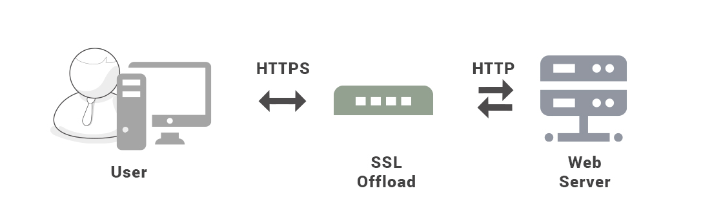
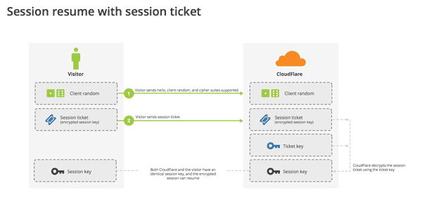
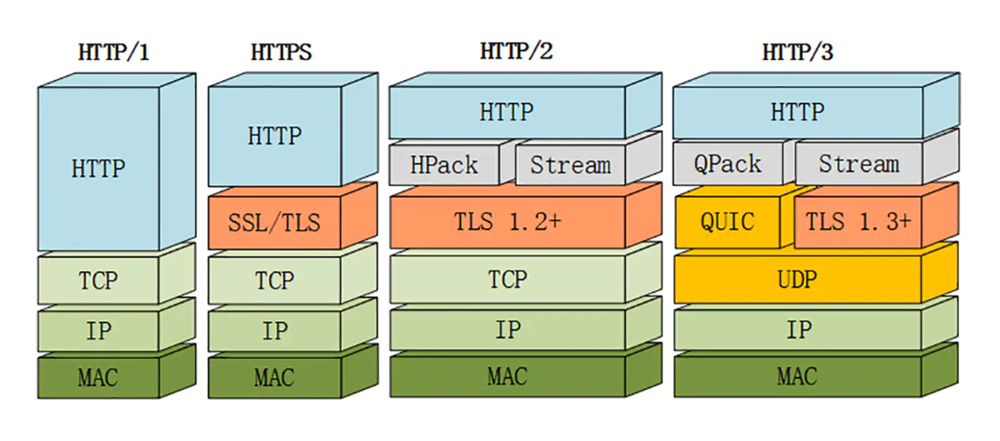

# HTTPS

## HTTP vs HTTPS

- HTTPS （Hypertext Transfer Protocol over Secure Socket Layer）是以安全为目标的 HTTP 通道，端口号是 443。HTTP 默认的端口号为 80。
- HTTP 和 HTTPS 使用的是完全不同的连接方式。
- HTTP 的连接很简单，是无状态的；HTTPS 协议是由 SSL+HTTP 协议构建的可进行加密传输、身份认证的网络协议，比 HTTPS 协议安全。
- HTTP 是超文本传输协议，信息是明文传输，HTTPS 则是具有安全性的 SSL 加密传输协议。
- HTTPS 协议需要到 CA 申请证书，一般免费证书较少，因而需要一定费用。

不使用 SSL/TLS 的 HTTP 通信，就是不加密的通信。所有信息明文传播，带来了三大风险。

-  **窃听风险**（eavesdropping）：使用明文进行通信，内容可能会被窃听（也就是被抓包分析）；
-  **篡改风险**（tampering）：无法证明报文的完整性，报文有可能已遭篡改。
-  **冒充风险**（pretending）：不验证通信方的身份，通信方的身份有可能遭遇伪装；

## **什么是 HTTPS？**

**HTTPS 是身披 SSL 外壳的 HTTP**

HTTPS 不是应用层的一种新协议。通常，HTTP 直接和 TCP 通信。在 HTTPS 中，让 HTTP 先和 SSL 通信，再由 SSL 和 TCP 通信。也就是说 HTTPS 使用了隧道进行通信。

简单来讲，HTTPS 是 HTTP 的安全版。只是 HTTP 通信接口部分用 SSL（Secure Socket Layer）和 TLS（Transport Layer Security）协议代替而已。

  
 

### 加密

#### **对称密钥加密**

只有一个私钥（Secret Key ），加密和解密同用一个密钥的方式称为共享密钥加密（Conmon-key crypto system）， 也被叫做对称密钥加密（Symmetric-Key Encryption）。

典型的对称加密算法有 DES、AES，RC5，3DES 等。

- 优点：运算速度快；

- 缺点：无法安全地将密钥传输给通信方。只要发送密钥就有被窃听的风险。

  
 

#### **非对称密钥加密**

非对称密钥加密，又称公开密钥加密（Public-Key Encryption），加密和解密使用不同的密钥。非对称加密算法有 RSA、DSA、DH 等。

公开密钥所有人都可以获得，通信发送方获得接收方的公钥后，使用公钥加密信息，接收方收到通信内容后使用私有密钥解密。利用这种方式，不需要发送用来解密的私有密钥，也不必担心密钥被攻击者窃听而盗走。

  
 

根据公开密钥将密文恢复到信息原文是异常困难的，因为解密过程就是在对离散对数进行求值。就目前的技术来看，不能对一个非常大的整数做到快速地因式分解。

非对称密钥还可以用来进行签名。私钥无法被其他人获取，通信发送方使用其私钥进行签名，接收方使用发送方的公钥对签名进行解密，就能判断这个签名是否正确。

- 优点：可以更安全地将公开密钥传输给通信发送方；
- 缺点：运算速度慢。

#### **HTTPS 采用混合的加密机制**

HTTPS 采用混合的加密机制：

对称密钥加密传输效率更高，但是无法安全地将私钥传输给通信方。而非对称密钥加密方式可以保证传输的安全性，因此我们可以利用非对称密钥加密方式将私钥传输给通信方。

- 使用非对称密钥加密方式传输对称密钥加密方式所需要的私钥，从而保证安全性；
- 获取到私钥后，再使用对称密钥加密方式进行通信，从而保证效率。

SSL 采用公开密钥加密的加密处理方式。

- 客户端向服务器端索要并验证公钥。
- 双方协商生成"对话密钥"。（Session Key 就是 Secret Key）
- 双方采用"对话密钥"进行加密通信。

前两步，又称为"握手阶段"（handshake）。

  
 

  
 

### 认证

公开密钥加密方式仍存在一些问题——无法证明公开密钥本身就是货真价实的公开密钥。或许在公开密钥传输途中，真正的公开密钥已经被攻击者替换掉了。

为了解决上述问题，可以使用由数字证书认证机构（CA，Certificate Authority）和其相关机关颁发的公开密钥证书。CA 是客户端与服务器双方都可信赖的<u>第三方机构</u>。通过使用  **证书**  来对通信方进行认证。

数字证书认证机构的业务流程：服务器的运营人员向数字证书认证机构提出公开密钥的申请，数字证书认证机构在判明提出申请者的身份之后，会对已申请的公开密钥做<u>数字签名</u>，然后分配这个已签名的公开密钥，并将该公开密钥放入公开密钥证书后绑定在一起。

进行 HTTPS 通信时，服务器会将由数字证书认证机构颁发的公钥证书发送给客户端，以进行公开密钥加密方式通信。公钥证书也可叫做数字证书或直接称为证书。客户端取得其中的公开密钥之后，先使用数字签名进行验证，如果验证通过，就可以开始通信了。

此处认证机关的公开密钥必须安全地转交给客户端。使用通信方式时，如何安全转交是一件很困难的事，因此，多数浏览器开发商发布版本时，会事先在内部植入常用认证机关的公开密钥。

  
 

### 完整性保护

SSL 提供报文摘要功能来进行完整性保护。

在 HTTPS 通信过程中，应用层发送数据时会附加一种叫做 MAC（Message Authentication Code）的报文摘要。MAC 能够查知报文是否遭到篡改，从而保护报文的完整性。

HTTP 也提供了 MD5 报文摘要功能，但不是安全的。例如报文内容被篡改之后，同时重新计算 MD5 的值，通信接收方是无法意识到发生了篡改。

HTTPS 的报文摘要功能之所以安全，是因为它结合了加密和认证这两个操作。加密之后的报文，遭到篡改之后，也很难重新计算报文摘要，因为无法轻易获取明文。

## SSL / TLS

SSL 是 netscape 公司设计的主要用于 Web 的安全传输协议。SSL 独立于 HTTP，其他运行在应用层的 SMTP 和 Telnet 等协议均可配合 SSL 协议使用。通过证书认证来确保客户端和网站服务器之间的通信数据是加密安全的。

- 第一，SSL 可以防止被黑客窃听数据。
- 第二，SSL 可以防止数据在传输过程中被黑客肆意篡改，保证数据传输的完整性。

**SSL 的版本**

1994 年，NetScape 公司设计了 SSL 协议的 1.0 版，但是未发布。

1995 年，NetScape 公司发布 SSL 2.0 版，很快发现有严重漏洞。

1996 年，SSL 3.0 版问世，得到大规模应用。

1999 年，互联网标准化组织 ISOC 接替 NetScape 公司，发布了 SSL 的升级版 TLS 1.0 （SSL 3.1）版。

2006 年和 2008 年，TLS 进行了两次升级，分别为 TLS 1.1（SSL 3.2） 版和 TLS 1.2 （SSL 3.3）版。最新的变动是 2011 年 TLS 1.2 的修订版。

TSL 是以 SSL 为原型开发的协议，有时会统一称该协议为 SSL。目前，应用最广泛的是 TLS 1.0，接下来是 SSL 3.0。但是，主流浏览器都已经实现了 TLS 1.2 的支持。

### SSL 速度慢吗？

SSL 的慢分两种。一种是指通信慢。另一种是指由于大量消耗 CPU 及内存等资源，导致处理速度变慢。

和使用 HTTP 相比，网络负载可能会变慢 2 到 100 倍。除去和 TCP 连接、发送 HTTP 请求 • 响应以外，还必须进行 SSL 通信，因此整体上处理通信量不可避免会增加。

另一点是 SSL 必须进行加密处理。在服务器和客户端都需要进行加密和解密的运算处理。因此从结果上讲，比起 HTTP 会更多地消耗服务器和客户端的硬件资源，导致负载增强。

针对速度变慢这一问题，并没有根本性的解决方案，我们会使用 SSL 加速器这种（专用服务器）硬件来改善该问题。该硬件为 SSL 通信专用硬件，相对软件来讲，能够提高数倍 SSL 的计算速度。仅在 SSL 处理时发挥 SSL 加速器的功效，以分担负载。

### 握手过程 

HTTPS 链接和 HTTP 链接都建立在 TCP 协议之上。HTTPS 除了要进行 TCP 三次握手，还需进行 SSL 握手。

开始加密通信之前，客户端和服务器首先必须建立连接和交换参数，这个过程叫做握手（handshake）。

握手阶段分成五步。

- 第一步，客户端给出协议版本号、一个客户端生成的随机数（Client random），以及客户端支持的加密方法。
- 第二步，服务器确认双方使用的加密方法，并给出数字证书、以及一个服务器生成的随机数（Server random）。
- 第三步，客户端确认数字证书有效，然后生成一个新的随机数（Premaster secret），并使用数字证书中的公钥，加密这个随机数，发给服务器。
- 第四步，服务器使用自己的私钥，获取爱丽丝发来的随机数（即Premaster secret）。
- 第五步，客户端和服务器根据约定的加密方法，使用前面的三个随机数，生成"对话密钥"（session key），用来加密接下来的整个对话过程。

  
 

  
 

握手阶段有三点需要注意。

- 生成对话密钥一共需要三个随机数。
- 握手之后的对话使用"对话密钥"加密（对称加密），服务器的公钥和私钥只用于加密和解密"对话密钥"（非对称加密），无其他作用。
- 服务器公钥放在服务器的数字证书之中。

从上面第二点可知，整个对话过程中（握手阶段和其后的对话），服务器的公钥和私钥只需要用到一次。

### 重新握手

握手阶段用来建立 SSL 连接。如果出于某种原因，对话中断，就需要重新握手。

有两种方法可以恢复原来的 session：

- session ID。

  每一次对话都有一个编号（session ID）。如果对话中断，下次重连的时候，只要客户端给出这个编号，且服务器有这个编号的记录，双方就可以重新使用已有的"对话密钥"，而不必重新生成一把。

  
  
 

  目前所有浏览器都支持 session ID，缺点在于 session ID 往往只保留在一台服务器上。

-  session ticket。

  解决  session ID 中的问题，目前只有 Firefox 和 Chrome 浏览器支持。

  
  
 

  客户端发送一个服务器在上一次对话中发送过来的 session ticket。这个session ticket 是加密的，只有服务器才能解密，其中包括本次对话的主要信息，比如对话密钥和加密方法。当服务器收到 session ticket 后，解密后就不必重新生成对话密钥了。

## HTTPS 的缺点

- HTTPS 需要进行加密解密等过程，因此速度会更慢；

  与纯文本通信相比，加密通信会消耗更多的 CPU 及内存资源。因此，如果是非敏感信息则使用 HTTP 通信，只有在包含个人信息等敏感数据时，才利用 HTTPS 加密通信。

- HTTPS 需要支付证书授权的高额费用。

# HTTP 版本

|  时间  |   版本   | 功能                                                         |
| :----: | :------: | :----------------------------------------------------------- |
| 1991年 | HTTP/0.9 | 仅支持 GET 请求，不支持请求头，仅能请求访问 HTML 格式的资源。 |
| 1996年 | HTTP/1.0 | 默认短连接（一次请求建议一次 TCP 连接，请求完就断开），支持 GET、POST、 HEAD 请求 |
| 1999年 | HTTP/1.1 | 默认长连接（一次 TCP 连接可以多次请求）； 支持 PUT、DELETE、PATCH 等六种请求 增加 host 头，支持虚拟主机； 支持断点续传功能 |
| 2015年 | HTTP/2.0 | 多路复用，降低开销（一次 TCP 连接可以处理多个请求）； 服务器主动推送（相关资源一个请求全部推送）； 解析基于二进制，解析错误少，更高效（HTTP/1.X 解析基于文本）； 报头压缩，降低开销。 |

  
 

# HTTP/1.1

1. **长连接**，HTTP 1.1 默认开启 Connection: keep-alive，支持长连接和流水线，减少了建立和关闭连接的消耗和延迟。HTTP1.0 默认短连接，每次请求都要创建连接。
2. **缓存处理**，在 HTTP1.0 中主要使用 header 里的 If-Modified-Since，Expires 来做为缓存判断的标准，HTTP1.1 则引入了更多的缓存控制策略例如 Entity tag，If-Unmodified-Since, If-Match, If-None-Match 等更多可供选择的缓存头来控制缓存策略。
3. **带宽优化及网络连接的使用**，HTTP1.0 中，存在一些浪费带宽的现象，例如客户端只是需要某个对象的一部分，而服务器却将整个对象送过来了，并且不支持断点续传功能，HTTP1.1 则在请求头引入了 range 头域，它允许只请求资源的某个部分，即返回码是 206（Partial Content），这样就方便了开发者自由的选择以便于充分利用带宽和连接。
4. **错误通知的管理**，在 HTTP1.1 中新增了 24 个错误状态响应码，如 409（Conflict）表示请求的资源与资源的当前状态发生冲突；410（Gone）表示服务器上的某个资源被永久性的删除。
5. **Host头处理**，在 HTTP1.0 中认为每台服务器都绑定一个唯一的 IP 地址，因此，请求消息中的 URL 并没有传递主机名。但随着虚拟主机技术的发展，在一台物理服务器上可以存在多个虚拟主机，并且它们共享一个 IP 地址。HTTP1.1 的请求消息和响应消息都应支持 Host 头域，且请求消息中如果没有 Host 头域会报告一个错误（400 Bad Request）。
6. 消息在网络中的发送
7. 互联网地址的维护
8. 安全性和完整性

## 连接管理

  
 

### **短连接与长连接**

当浏览器访问一个包含多张图片的 HTML 页面时，除了请求访问的 HTML 页面资源，还会请求图片资源。如果每进行一次 HTTP 通信就要新建一个 TCP 连接，那么开销会很大。

为解决上述 TCP 连接的问题，HTTP/1.1 和一部分的 HTTP/1.0 想出了持久连接（HTTP Persistent Connections，也称为 HTTP keep-alive 或 HTTP connection reuse，长连接）的方法。持久连接的好处在于减少了 TCP 连接的重复建立和断开所造成的额外开销，减轻了服务器端的负载。另外，减少开销的那部分时间，使 HTTP 请求和响应能够更早地结束，这样 Web 页面的显示速度也就相应提高了。

长连接只需要建立一次 TCP 连接就能进行多次 HTTP 通信。

- 从 HTTP/1.1 开始默认是长连接的，如果要断开连接，需要由客户端或者服务器端提出断开，使用 `Connection : close`；
- 在 HTTP/1.1 之前默认是短连接的，如果需要使用长连接，则使用 `Connection : Keep-Alive`。虽然有一部分服务器通过非标准的手段实现了持久连接，但服务器端不一定能够支持持久连接。毫无疑问，除了服务器端，客户端也需要支持持久连接。

### **流水线**

> 不等待响应，直接发送下一个请求。

默认情况下，HTTP 请求是按顺序发出的，下一个请求只有在当前请求收到响应之后才会被发出。由于受到网络延迟和带宽的限制，在下一个请求被发送到服务器之前，可能需要等待很长时间。

持久连接使得多数请求以管线化（pipelining，流水线）方式发送成为可能。流水线是在同一条长连接上连续发出请求，而不用等待响应返回，这样可以减少延迟。

而管线化技术则比持久连接还要快。请求数越多，时间差就越明显。

## SPDY

# HTTP/2.0

## HTTP/1.x 缺陷

HTTP/1.x 实现简单是以牺牲性能为代价的：

- 客户端需要使用多个连接才能实现并发和缩短延迟；
- 不会压缩请求和响应首部，从而导致不必要的网络流量；
- 不支持有效的资源优先级，致使底层 TCP 连接的利用率低下。

## HTTP/2.0 新特性

### 二进制分帧层

HTTP/2.0 将报文分成 HEADERS 帧和 DATA 帧，它们都是二进制格式的。

  
 

在通信过程中，只会有一个 TCP 连接存在，它承载了任意数量的双向数据流（Stream）。

- 一个数据流（Stream）都有一个唯一标识符和可选的优先级信息，用于承载双向信息。
- 消息（Message）是与逻辑请求或响应对应的完整的一系列帧。
- 帧（Frame）是最小的通信单位，来自不同数据流的帧可以交错发送，然后再根据每个帧头的数据流标识符重新组装。

  
 

### 服务端推送

HTTP/2.0 在客户端请求一个资源时，会把相关的资源一起发送给客户端，客户端就不需要再次发起请求了。例如客户端请求 page.html 页面，服务端就把 script.js 和 style.css 等与之相关的资源一起发给客户端。

  
 

### 首部压缩

HTTP/1.1 的首部带有大量信息，而且每次都要重复发送。

HTTP/2.0 要求客户端和服务器同时维护和更新一个包含之前见过的首部字段表，从而避免了重复传输。

不仅如此，HTTP/2.0 也使用 Huffman 编码对首部字段进行压缩。

  
 

### 多路复用

- HTTP/1.* 一次请求-响应，建立一个连接，用完关闭；每一个请求都要建立一个连接；
- HTTP/1.1 Pipeling解决方式为，若干个请求排队串行化单线程处理，后面的请求等待前面请求的返回才能获得执行机会，一旦有某请求超时等，后续请求只能被阻塞，毫无办法，也就是人们常说的线头阻塞；
- HTTP/2多个请求可同时在一个连接上并行执行。某个请求任务耗时严重，不会影响到其它连接的正常执行；

## HTTP/2.0 缺点

当 TCP 连接出现丢包时，HTTP/2 的表现情况反倒不如 HTTP/1 了。

在出现丢包的情况下，整个 TCP 都要开始等待重传，也就导致了后面的所有数据都被阻塞了。但是对于 HTTP/1.1 来说，可以开启多个 TCP 连接，出现这种情况只会影响其中一个连接，剩余的 TCP 连接还可以正常传输数据。

基于这个原因，**Google 提出了一个基于 UDP 协议的 QUIC 协议，并且在 HTTP/3 上使用**，HTTP/3 之前名为 HTTP-over-QUIC，从这个名字中也可以发现，HTTP/3 最大的改造就是使用了 QUIC。

# HTTP/3

HTTP3 的传输层使用 UDP 协议，通过重传保证传输可靠。

## QUIC

# 参考资料

- [What Is This HTTPS/SSL Thing And Why Should You Care?](https://www.x-cart.com/blog/what-is-https-and-ssl.html)
- [What is SSL Offloading?](https://securebox.comodo.com/ssl-sniffing/ssl-offloading/)
- [An Introduction to Mutual SSL Authentication](https://www.codeproject.com/Articles/326574/An-Introduction-to-Mutual-SSL-Authentication)
- [HTTPS 证书原理](https://shijianan.com/2017/06/11/https/)
- [Symmetric vs. Asymmetric Encryption – What are differences?](https://www.ssl2buy.com/wiki/symmetric-vs-asymmetric-encryption-what-are-differences)
- [Web 性能优化与 HTTP/2](https://www.kancloud.cn/digest/web-performance-http2)
- [HTTP/2 简介](https://developers.google.com/web/fundamentals/performance/http2/?hl=zh-cn)
- [SSL/TLS协议运行机制的概述 - 阮一峰](SSL/TLS协议运行机制的概述 - 阮一峰)
- [图解SSL/TLS协议 - 阮一峰](http://www.ruanyifeng.com/blog/2014/09/illustration-ssl.html)
- [HTTPS 建立连接的详细过程](https://www.cnblogs.com/liyuhui-Z/p/7844880.html)
- [HTTPS的七个误解（译文） - 阮一峰](http://www.ruanyifeng.com/blog/2011/02/seven_myths_about_https.html)
- [SSL延迟有多大？ - 阮一峰](http://www.ruanyifeng.com/blog/2014/09/ssl-latency.html)
- [HTTP协议-HTTP3 - 简书](https://www.jianshu.com/p/dd9719c4c2c1)
- [HTTP1.0、HTTP1.1和HTTP2.0的区别 - 简书](https://www.jianshu.com/p/be29d679cbff)
- [Http 1.x弊端与Http 2.0比较](https://www.cnblogs.com/barrywxx/p/8570006.html)
- [一文读懂HTTP/2及HTTP/3特性 - 简书](https://www.jianshu.com/p/c5571765eb3e)

