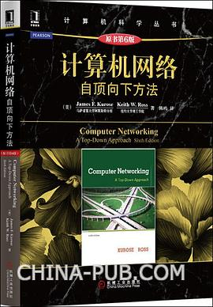
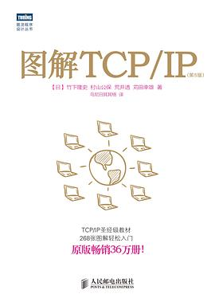
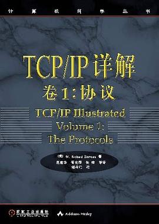
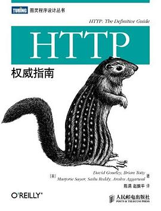
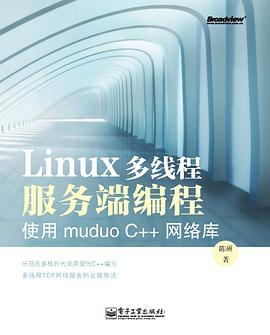

# 计算机网络

## 《计算机网络 自顶向下方法》第六版

 [美]JamesF.Kurose/[美]KeithW.Ross/ 2014-10 / 机械工业出版社

[豆瓣](https://book.douban.com/subject/26176870/) 8.9 分，481 人评分。

  
 

适合当做入门书籍，重点阅读前四章内容。

## 《计算机网络》第六版

谢希仁 / 2013-6-1 / 电子工业出版社

[豆瓣](https://book.douban.com/subject/24740558/) 7.8 分，190 人评分。

  
 

大部分学校的教材，可以当做上一本书（自顶向下方法）的辅助书籍，结合着看。

## 《图解 TCP/IP 》第5版

 [日]竹下隆史/[日]村山公保/[日]荒井透/[日]苅田幸雄 / 2013-7-1 / 人民邮电出版社 / 图灵教育（出品）

[豆瓣](https://book.douban.com/subject/24737674/)，7.8 分，888 人评分。

  
 

## 《TCP/IP 详解》卷1：协议

 [美]W·RichardStevens/ 2000-4-1 / 机械工业出版社

[豆瓣](https://book.douban.com/subject/1088054/) 9.2 分，2098 人评分。

  
 

TCP/IP 是网络中最重要的一部分，对于某些面试高频知识点，建议阅读这本书的相应章节进行深入学习。

## 《图解 HTTP 》 

[日]上野宣/ 2014-4-15 / 人民邮电出版社 / 图灵教育（出品）

[豆瓣](https://book.douban.com/subject/25863515/) 8.1 分，2412 人评分。

  
 

HTTP 也是网络中非常重要的部分，这本书使用大量图示进行讲解，所以非常通俗易懂。

## 《HTTP权威指南》（1）

David Gourley / Brian Totty / 2012-9 / 人民邮电出版社 / 图灵教育（出品）

[豆瓣](https://book.douban.com/subject/10746113/)，8.6 分，1509 人评分。

  
 

涉及web开发的前端、后台、运维的同学都可以看看。web应用架构师必看。其中对其中“缓存”、“负载均衡“等章节印象很深，标准的教科书啊，肯定比看枯燥的HTTP规范好多了。

# 网络编程

## 《UNIX 网络编程》 第 1 卷：套接字联网 API

史蒂文斯 / 芬纳 / 鲁道夫  / 2006-1 / 清华大学出版社 / 

[豆瓣](https://book.douban.com/subject/1500149/) 9.5 分，957 人评分。

  
 

UNIX 网络编程（UNP）和 UNIX 环境高级编程（APUE）被称为腾讯的敲门砖，C++ 岗位的同学都应该学习一下。Java 或者其它岗位的同学倒是没那么高的要求，但是某些内容还是需要学习一下。这两本书是大部头，从头看到尾不太现实，比较适合当做工具书，在你碰到问题的时候再去查找书中的内容。

 

## 《Linux 多线程服务端编程》

陈硕  / 2013-1-15 / 电子工业出版社

[豆瓣](https://book.douban.com/subject/20471211/) 8.8 分，475 人评分。

  
 

比 UNP 更贴近实践，如果想做 Web Server 等项目的话，建议先看这本书。

 

