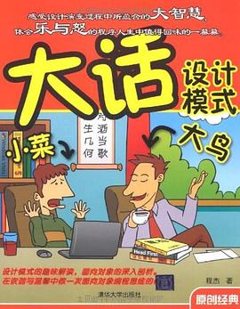
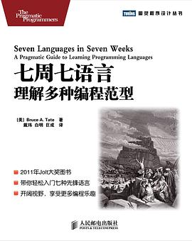

## 《大话设计模式》

程杰/ 2007-12-1 / 清华大学出版社

[豆瓣](https://book.douban.com/subject/2334288/)，8.3 分，1969 人评分。

  
 

用多个小故事或编程示例来组织讲解 GoF 总结的 23 个设计模式。其中，第 1、3、4、5 章着重讲解了面向对象的意义、好处以及几个重要的设计原则；第 2 章，以及第 6 到第 28 章详细讲解了 23 个设计模式；第 29 章是对设计模式的全面总结。附录部分是通过一个例子的演变为初学者介绍了面向对象的基本概念。

 

## 《 Head First 设计模式》

（中文版） [美]弗里曼/ 2007-9 / 中国电力出版社

[豆瓣](https://book.douban.com/subject/2243615/)，9.2 分，3066 人评分。

  
 

介绍了 23 个设计模式，同样采用场景对话、打比方的方式来讲解，巧妙地让设计模式的理论在实际应用中体现出来，淡化了抽象性。

 

## 《设计模式》

可复用面向对象软件的基础

 [美]ErichGamma/RichardHelm/RalphJohnson/JohnVlissides/ 2000-9 / 机械工业出版社

[豆瓣](https://book.douban.com/subject/1052241/)，9.0 分，2886 人评分。

  
 

**必读经典。**设计模式领域的开山鼻祖，必读，并且值得多读几遍。虽然其中的例子是 C++ 写的，但也很适合 Java 学习者读。

 

## 《设计模式解析》

Alan Shalloway / 徐言声 / 2013-1 / 人民邮电出版社

 [豆瓣](https://book.douban.com/subject/20406704/)，7.4 分，19 人评分。

  
 

## 《七周七语言——理解多种编程范型》

[美] Bruce A·Tate / 2012-5-8 / 人民邮电出版社

[豆瓣](https://book.douban.com/subject/10555435/)，8.1 分，782 人评分。

  
 

