# 简介

仿蘑菇街 app。

- 框架/工具：vue cli3 + vue （2.6.11）+ vue-router + axios + vuex + vue-lazyload
- 安装 Vue 的方式： vue cli3

初衷：对 Vue 组件化、规模化思想有进一步的实践经验，对前端工程化有进一步的认识。


**实现功能**

- 首页：轮播图、组件化思想、默认路由、keep-alive、上拉刷新、生命周期钩子、网络请求……。
- 分类：组件化思想，部分功能类似首页。
- 购物车：选中商品总价、全选。（Vuex）
- 详情：轮播图、声明周期钩子等。


**组件关系图**

- √：keep-alive
- 五角星：公有组件。
- 实心☆：与业务逻辑有关的公有组件。
- 空心☆：在公有组件的基础上，进一步抽离，不仅可用于项目内，还可用于其他项目中。

<div align="center"> 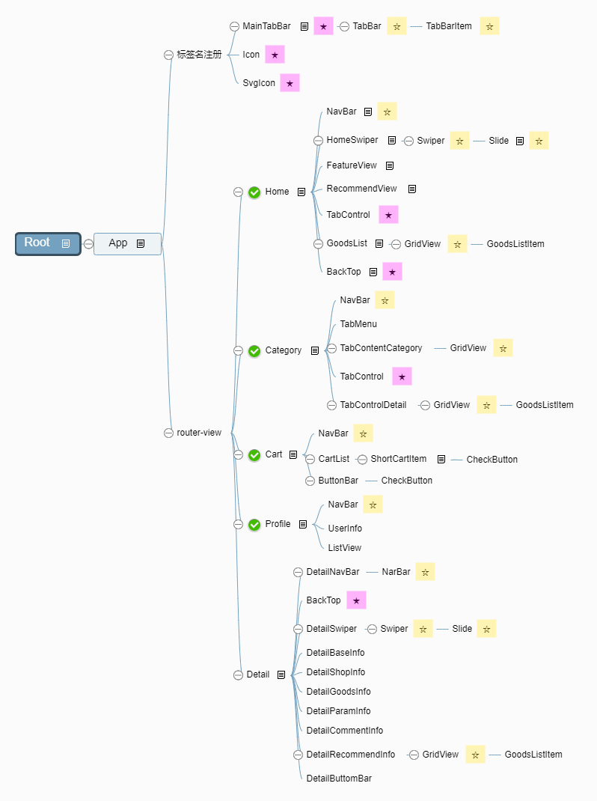 </div><br>


# 演示

**初始界面**

默认路由设置为首页

<div align="center"> 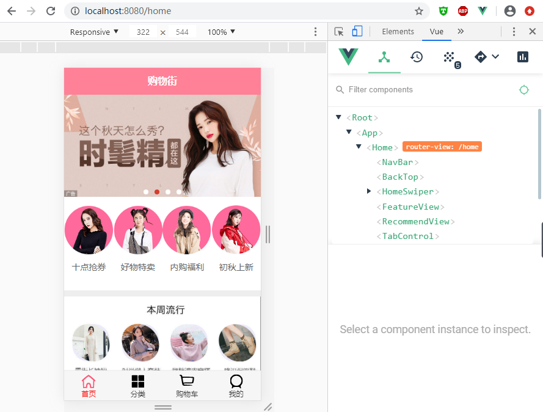 </div><br>

轮播图组件

<div align="center"> 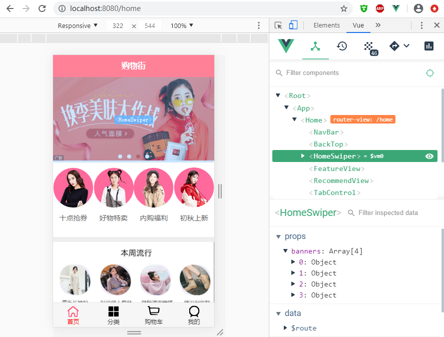 </div><br>


## **首页**

滚动超过 1000，自动出现回到顶部的按钮。

<div align="center"> 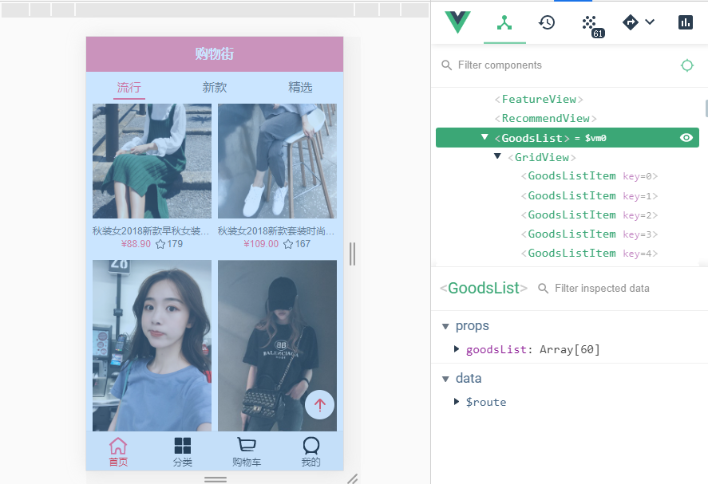 </div><br>


滑动到底部，重新发动网络请求，加载新数据（数组长度：60->118)

<div align="center"> 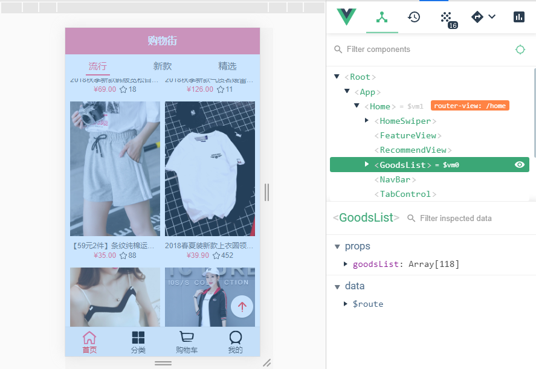 </div><br>


跳转至其他页面，重新回到首页时，返回到离开时的位置，而不是显示首页顶部。

- 在首页中，选中“新款”

<div align="center"> 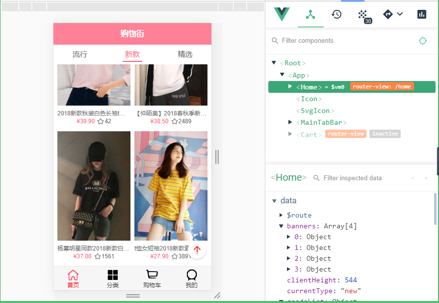 </div><br>

- 跳转至购物车

<div align="center"> 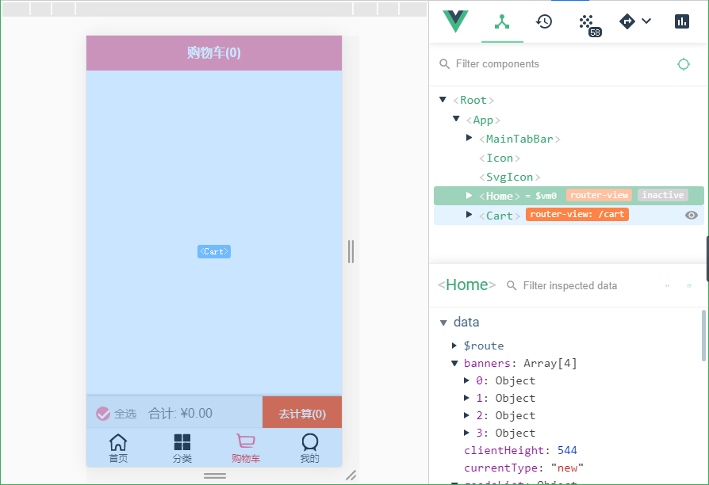 </div><br>

- 重新跳转回首页，仍然是离开时的页面

<div align="center"> 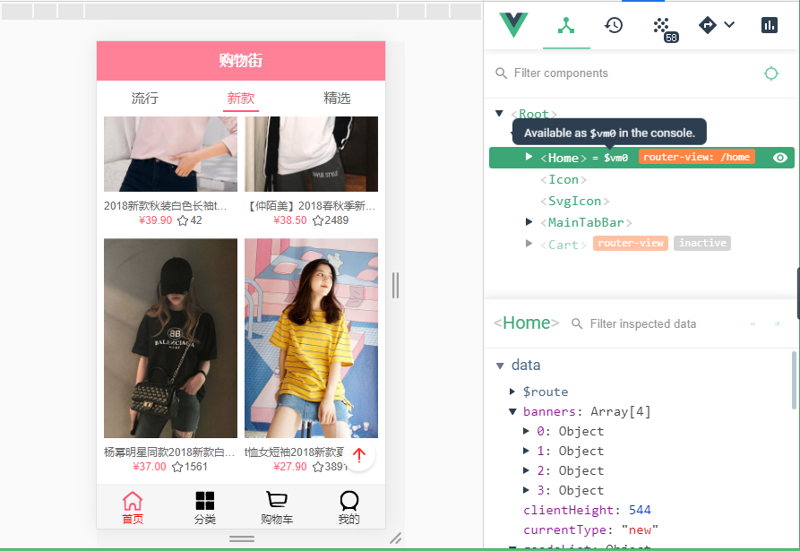 </div><br>


## **详情**

从首页或分类中点击商品图片，进入商品详情页面

<div align="center"> 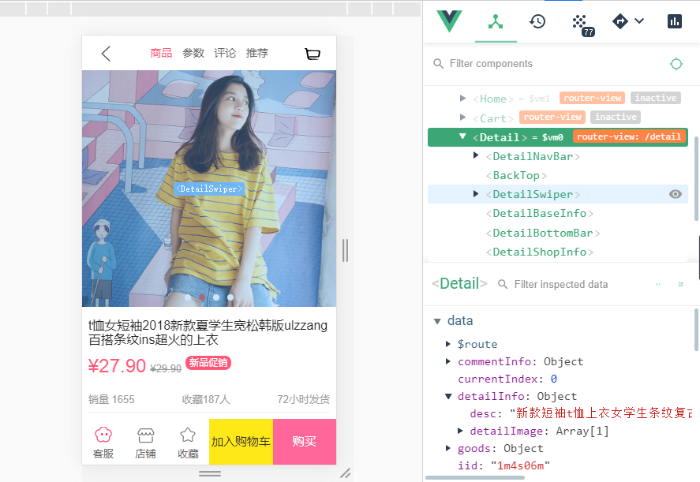 </div><br>

点击顶部导航，跳转至相应的内容

<div align="center"> 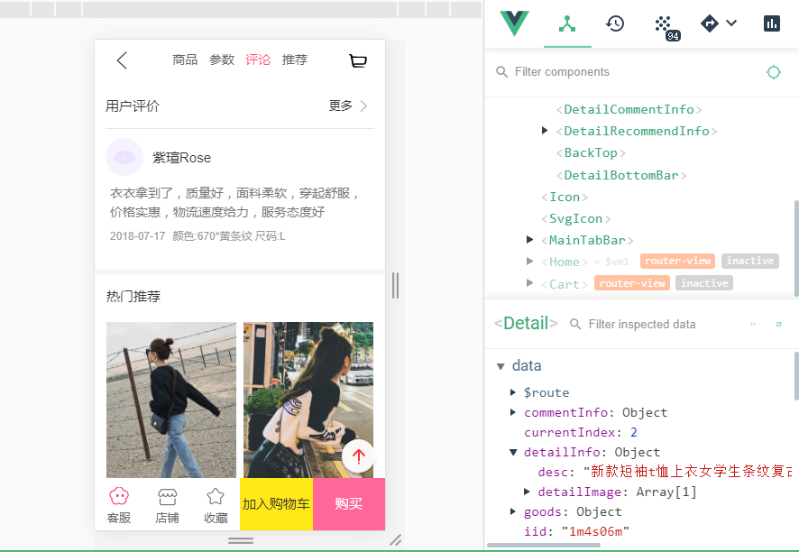 </div><br>

滑动至相应内容，顶部导航变换到相应内容

<div align="center"> 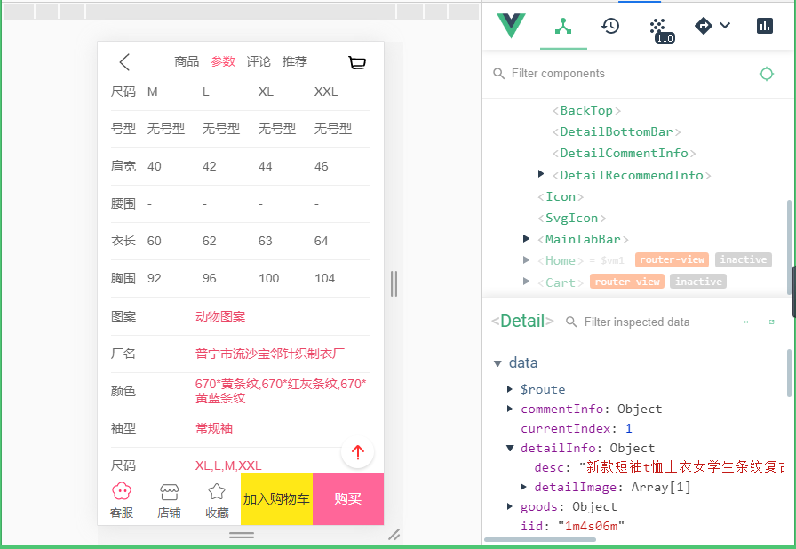 </div><br>


## **加入购物车**

从商品详情页中点击底部按钮“加入购物车”，将商品加入购物车。

可以从商品详情页（顶部右侧图标）跳转至购物车，也可以从商品详情页返回，然后在首页或分类的底部导航中选择“购物车”。

<div align="center"> 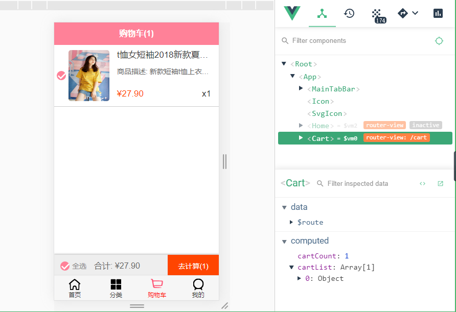 </div><br>


将多个商品加入购物车，合计总价自动计算

<div align="center"> 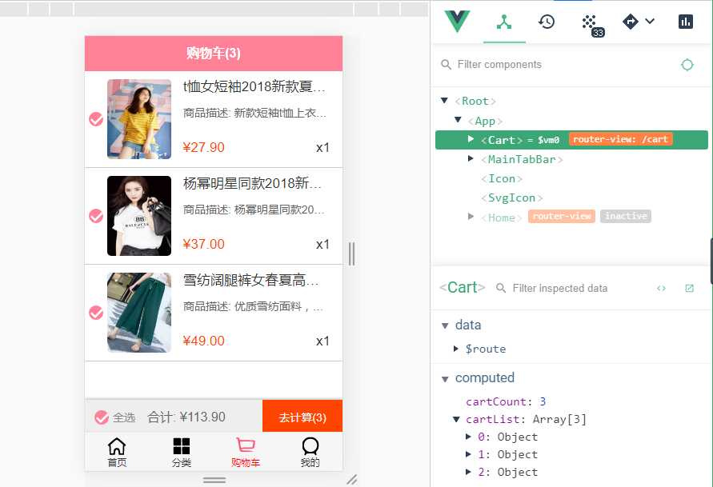 </div><br>


取消选中某些商品，全选按钮自动变化， 总价重新计算。

<div align="center"> 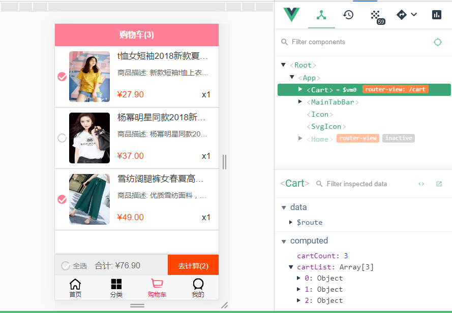 </div><br>


## **分类**

分类中的初始页面

<div align="center"> 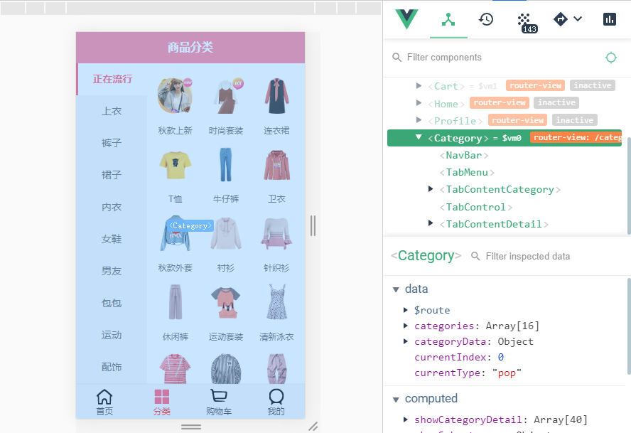 </div><br>


选中左边的选项，并滑动右边的窗口

<div align="center"> 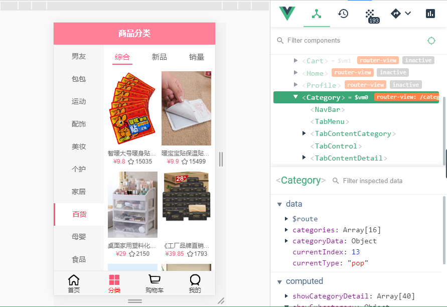 </div><br>


# 开发过程记录

## 创建项目

使用 Vue CLI 创建项目：

```
vue create vue-mall
```


## 划分目录结构

public：相当于 vue cli2 的 static，原封不动的复制到打包文件夹

src 源代码

- assets 资源
  - css
    - base.css 
    - normalize.css：使浏览器呈现所有 HTML 元素更加一致。
  - img
- common：公共的 JavaScript 代码
  - const.js：公共的常量
  - utils.js：公共的工具
  - mixin.js
- components：公共的组件
  - common：构建 content 的组件。完全公共的组件，不仅仅用于项目本身。
  - content：构建内容的公共组件，与业务相关的组件。
- network：网络模块封装
- router：前端路由
- store：状态管理
- views：与视图相关的组件

vue.config.js：自定义配置文件

.editconfig：代码风格


## 项目的模块划分

- navbar
- content
- tabar
- ……


## 路由配置 router

```
npm install vue-router --save
```


## 请求数据 axios


```
npm install axios --save
```


### tab-bar

可从公共组件中抽离出来，可用到其它项目中的组件。


### 购物车

```
npm install vuex --save
```


## 优化

```
npm install vue-lazyload --save
```


## 远程仓库

1、登录 github

2、创建仓库（比如 mall）

- 不需要加 README（因为Vue CLI3 自动生成）
- 不需要加 .gitignore（因为Vue CLI3 自动生成）
- 协议一般选 MIT 或 Apache


3、克隆项目

点击clone，复制web URL，在命令提示符中输入

```
git clone https://github.com/CodeCat2020/mall.git
```

注意：如果仓库名和项目名重复，先修改项目名（比如mall1）


4、将远程仓库和创建的项目合并

根据执行上述命令时，CMD所在的目录找到克隆下来的仓库 mall。

复制本地项目mall1的目录和文件（除了.git目录和node_modules目录），粘贴到mall。

- mall1中已有.git目录
- node_modules目录是被忽略的，可通过本地项目的 .gitignore文件查看。


5、查看mall中未管理的文件和目录

在命令提示符中切换到mall所在目录，通过 git status 查看。

```
git status
```

执行以下命令，将上述文件和目录加入管理，

```
git add .
```

提交

```
git commit -m '初始化项目'
```


另一种方式：不用克隆和修改本地项目名，直接将本地项目提交到远程仓库

```
git remote add origin https://github.com/CodeCat2020/mall.git
git push -u origin master
```


